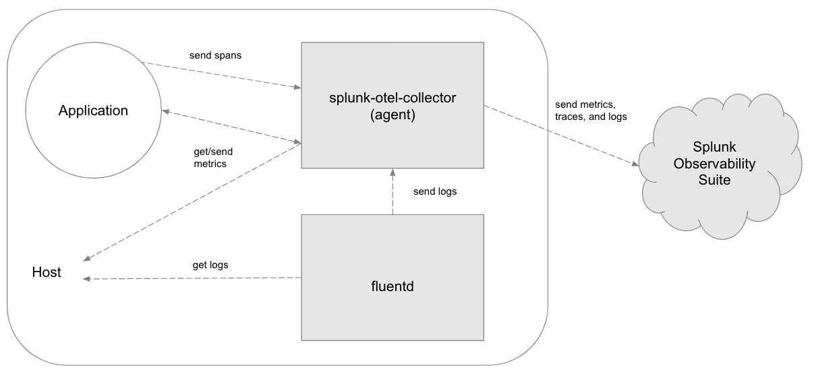
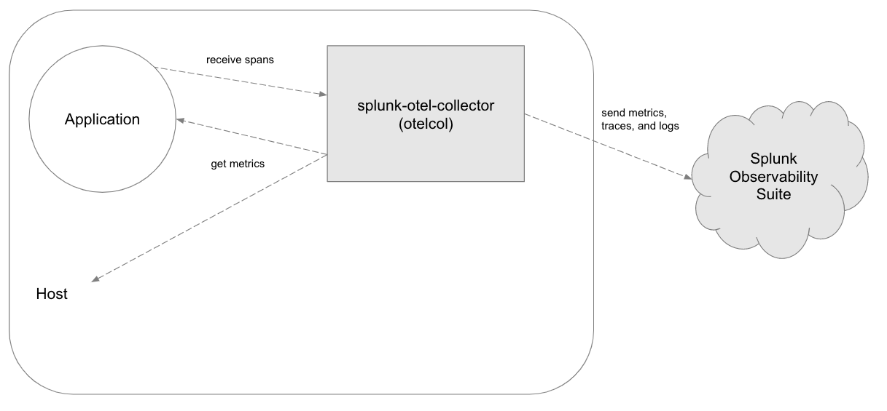
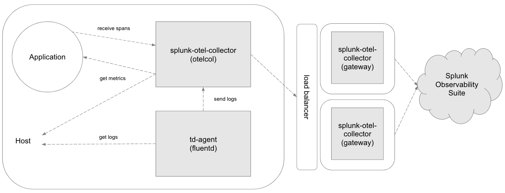

# Architecture

This distribution can be deployed in the below ways.

## Helm or Installer Script (Recommended)

If Helm or the installer script is used then the architecture will look similar
to above. The actual configuration of the components is as follows:

- [splunk-otel-collector (otelcol)](https://github.com/signalfx/splunk-otel-collector/blob/main/cmd/otelcol/config/collector/agent_config.yaml)
- [td-agent (fluentd)](https://github.com/signalfx/splunk-otel-collector/tree/main/internal/buildscripts/packaging/fpm/etc/otel/collector/fluentd)

## Standalone

If deployed in standalone, only the splunk-otel-collector is deployed and
configured. Note the default configuration for standalone is gateway-mode instead of agent-mode like above:

- [splunk-otel-collector (otelcol)](https://github.com/signalfx/splunk-otel-collector/blob/main/cmd/otelcol/config/collector/gateway_config.yaml)

## Advanced

It is possible to manually configure the splunk-otel-collector running as an
agent to send to a splunk-otel-collector gateway instance/cluster.
