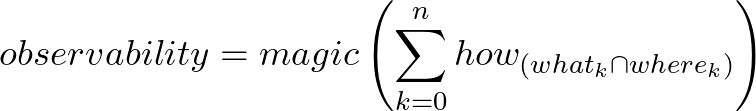
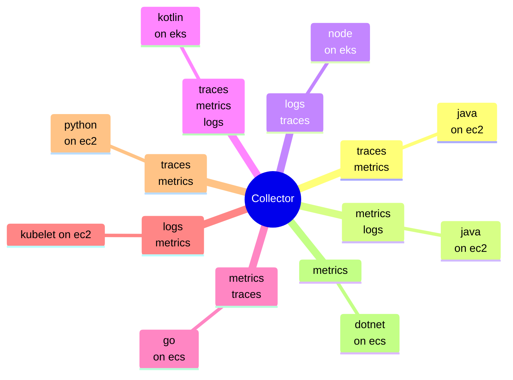
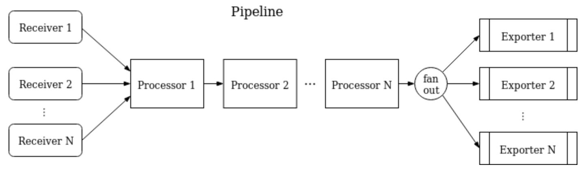
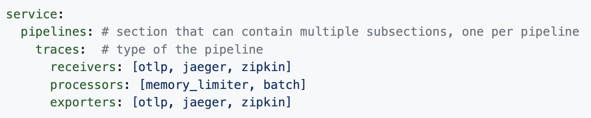
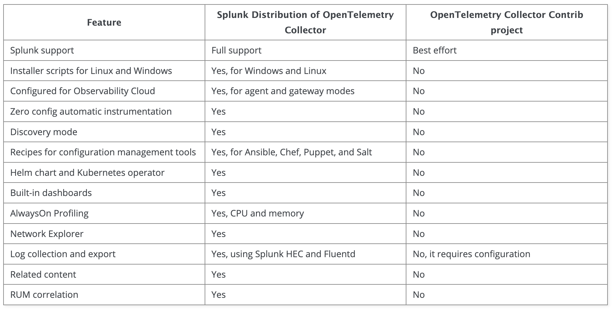
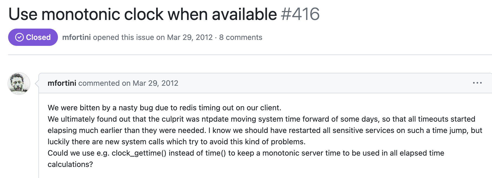
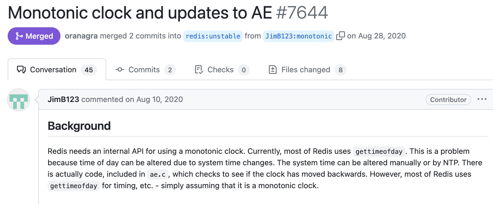

# Splunk OpenTelemetry Collector

### Crash Course

---

## Appeal to authority

"Benchmarks are only as good as the programs they measure." - [Russ Cox](https://go.dev/blog/pprof)

(this may be a deep joke)

## Overview

* i. recap on o11y
* ii. recap on OTel
* I. what's the collector?
* II. what's it do?
* III. do you even collect?

---

## i. Thoughts on "what, where, and how" in observability

my (wrong) hypothesis:

The core of observability is the surfacing (how) of an internal state (what & where) for a given context.



---

*Observability in the field ([source](https://www.splunk.com/en_us/pdfs/resources/e-book/amir-and-the-magical-lens.pdf))*


---

*Pseudocode examples of how, what, and where:*

```
// read the state from a file
state = read({ from: file })
```

```
// write a state delta to some stream
write({
  where: stdout,
  ts: current_time(),
  data: current_state - previous_state,
})
```

---

```
// request the state from some network entity
state = request({
  from: some_entity,
  getter: resp => b64.decode(resp.data["some context"])
})
```

```
// include the state in a response to a request for some context
on_request({
  to: some_context,
  do: (req, resp) => resp.write({ data: not_quite_the_state / 12345.6789 })
})
```

---

The act of surfacing takes many forms, all of which are ~~bitterly~~ inherently context specific.

It will always require a dedicated handle or some adequate proxy (where) for the state to be surfaced.

---

*An example:* 

How long has this system been running?


---

```bash
$ uptime -p
up 7 hours, 12 minutes

$ which uptime && uptime --version
/usr/bin/uptime
uptime from procps-ng 4.0.2
```

---

*From https://gitlab.com/procps-ng/procps/-/blob/master/library/uptime.c*
```c
#define UPTIME_FILE "/proc/uptime"
<...>
(fp = fopen(UPTIME_FILE, "r"))
<...>
rc = fscanf(fp, "%lf %lf", &up, &idle);
```

---

```bash
$ cat /proc/uptime
25969.41 200217.96

$ stat -c '%s %F' /proc/uptime
0 regular empty file

$ findmnt proc
TARGET SOURCE FSTYPE OPTIONS
/proc  proc   proc   rw,nosuid,nodev,noexec,relatim
```

---

*From proc(5) manpage:*
```
# The  proc  filesystem  is  a pseudo-filesystem which provides an interface to kernel data structures.
# <...>
# /proc/uptime
#   This file contains two numbers (values in seconds):
#   the uptime of the system (including time spent in suspend) and the amount of time spent in the idle process.
```

*From https://github.com/torvalds/linux/blob/master/fs/proc/uptime.c*
```c
seq_printf(m, "%lu.%02lu %lu.%02lu\n",
          (unsigned long) uptime.tv_sec,
          (uptime.tv_nsec / (NSEC_PER_SEC / 100)),
          (unsigned long) idle.tv_sec,
          (idle.tv_nsec / (NSEC_PER_SEC / 100)));
```

---


`CLOCK_BOOTTIME` - https://www.man7.org/linux/man-pages/man7/time_namespaces.7.html

`CPUTIME_IDLE` - https://github.com/torvalds/linux/blob/master/include/linux/kernel_stat.h
 - https://github.com/torvalds/linux/blob/master/kernel/sched/cputime.c ???

*https://github.com/torvalds/linux/blob/master/kernel/time/timekeeping.c*
```c
u64 notrace ktime_get_boot_fast_ns(void)
{
	struct timekeeper *tk = &tk_core.timekeeper;

	return (ktime_get_mono_fast_ns() + ktime_to_ns(data_race(tk->offs_boot)));
}
```

--- 

Observability is zero without a what (for a context)

what: the state to surface for a context.

---

Observability is zero without a where (for a context)

where: the location of the state to surface for a context.

Sometimes what and where are the same thing.

---

Observability is zero without a how...

---

## ii. OpenTelemetry


*What is it? [source](https://opentelemetry.io/)*
* "OpenTelemetry is a collection of APIs, SDKs, and tools."
* "OpenTelemetry is a CNCF incubating project. Formed through a merger of the [OpenTracing](https://opentracing.io/) and [OpenCensus](https://opencensus.io/) projects."

---

OpenTelemetry specifications are maintained here: https://github.com/open-telemetry/opentelemetry-specification/tree/main/specification

In OpenTelemetry there are currently three standardized types of state presentation (telemetry).

*([source](https://imgs.xkcd.com/comics/standards.png))


---

Their reference implementation, used by effectively all OpenTelemetry libraries, is the OpenTelemetry Protocol (OTLP).

It is located here: https://github.com/open-telemetry/opentelemetry-proto

All of these telemetry types share a metadata envelope called a *Resource* ~defined by
https://github.com/open-telemetry/opentelemetry-proto/blob/main/opentelemetry/proto/resource/v1/resource.proto

---

### Logs

A representation of instantaneous state ~defined by
https://github.com/open-telemetry/opentelemetry-proto/blob/main/opentelemetry/proto/logs/v1/logs.proto

---

*opentelemetry-python logging example ([source](https://github.com/open-telemetry/opentelemetry-python/blob/main/docs/examples/logs/example.py))*
```python
logger_provider = LoggerProvider(
    resource=Resource.create(
        {
            "service.name": "shoppingcart",
            "service.instance.id": "instance-12",
        }
    ),
)
set_logger_provider(logger_provider)

exporter = OTLPLogExporter(insecure=True)
logger_provider.add_log_record_processor(BatchLogRecordProcessor(exporter))
handler = LoggingHandler(level=logging.NOTSET, logger_provider=logger_provider)
```

---

```python
# Attach OTLP handler to root logger
logging.getLogger().addHandler(handler)

# Log directly
logging.info("Jackdaws love my big sphinx of quartz.")

# Create different namespaced loggers
logger1 = logging.getLogger("myapp.area1")
logger2 = logging.getLogger("myapp.area2")

logger1.debug("Quick zephyrs blow, vexing daft Jim.")
logger1.info("How quickly daft jumping zebras vex.")
logger2.warning("Jail zesty vixen who grabbed pay from quack.")
logger2.error("The five boxing wizards jump quickly.")
```

---

### Traces

A graph representation of momentary states ~defined by
https://github.com/open-telemetry/opentelemetry-proto/blob/main/opentelemetry/proto/trace/v1/trace.proto

---

*opentelemetry-python tracing example ([source](https://github.com/open-telemetry/opentelemetry-python/blob/main/docs/examples/basic_tracer/basic_trace.py))*
```python
from opentelemetry import trace
from opentelemetry.sdk.trace import TracerProvider
from opentelemetry.sdk.trace.export import (
    BatchSpanProcessor,
    ConsoleSpanExporter,
)

trace.set_tracer_provider(TracerProvider())
trace.get_tracer_provider().add_span_processor(
    BatchSpanProcessor(ConsoleSpanExporter())
)
```

---

```python
tracer = trace.get_tracer(__name__)
with tracer.start_as_current_span("foo"):
    print("Hello world!")
```

---

### Metrics

A numeric representation of instantaneous state ~defined by
https://github.com/open-telemetry/opentelemetry-proto/blob/main/opentelemetry/proto/metrics/v1/metrics.proto

---

*opentelemetry-python metrics example ([source](https://github.com/open-telemetry/opentelemetry-python/blob/main/docs/examples/metrics/instruments/example.py))*
```python
from opentelemetry.exporter.otlp.proto.grpc.metric_exporter import (
    OTLPMetricExporter,
)
from opentelemetry.metrics import (
    get_meter_provider,
    set_meter_provider,
)
from opentelemetry.sdk.metrics import MeterProvider
from opentelemetry.sdk.metrics.export import PeriodicExportingMetricReader
```

---

```python
exporter = OTLPMetricExporter(insecure=True)
reader = PeriodicExportingMetricReader(exporter)
provider = MeterProvider(metric_readers=[reader])
set_meter_provider(provider)

meter = get_meter_provider().get_meter("getting-started", "0.1.2")

counter = meter.create_counter("counter")
counter.add(1)
```

---

There are APIs and SDKs for a lot of languages, including auto-instrumentation offerings for many client and server libraries.

---

There are even cases of first-class adoption in major applications:

* [kubernetes](https://kubernetes.io/docs/concepts/cluster-administration/system-traces/)
* [docker](https://docs.docker.com/build/building/opentelemetry/)
* [cri-o](https://github.com/cri-o/cri-o/pull/4883)
* [containerd](https://github.com/containerd/containerd/blob/main/docs/tracing.md)

---

Despite the large selection of instrumentation offerings, the export protocol options are limited to pretty much OTLP (or prometheus).

This is good for users in avoiding vendor lock-in while adopting OTel dependenciees in their applications.

But this is limiting for them in reporting options.

It also creates a scenario where all telemetry reporters would need specialized configuration and handling of the telemetry to be accessible.

---

## I. The Collector



---

The OpenTelemetry Collector is an effort to provide and support a unified interface to functionality built from new and existing OSS libraries for:

1. Receiving/gathering state from specific and arbitrary sources (targets and protocols)
2. Sending/exposing state to specific and arbitrary sources (targets and protocols)

---

It is a standalone application, a service framework, and collection of component libraries for adoption in custom distributions or arbitrary Go programs.

---

The core source is located here https://github.com/open-telemetry/opentelemetry-collector 

---

There is a community contributions project and distribution that "wrap" the core project and includes third-party library/target services and vendor-compatible components.

---

The contrib source is located here: https://github.com/open-telemetry/opentelemetry-collector-contrib

---

Both have releases maintained here: https://github.com/open-telemetry/opentelemetry-collector-releases

---

The collector could be thought of a widely scalable method of providing how, what, and where for small to massive deployments.

It does this by:

*CRUD-ing telemetry*

---

### create

*host metrics receiver ([source](https://github.com/open-telemetry/opentelemetry-collector-contrib/blob/main/receiver/hostmetricsreceiver/internal/scraper/processscraper/internal/metadata/generated_metrics.go))*

```go
func (m *metricProcessCPUTime) init() {
    m.data.SetName("process.cpu.time")
    m.data.SetDescription("Total CPU seconds broken down by different states.")
    m.data.SetUnit("s")
    m.data.SetEmptySum()
    m.data.Sum().SetIsMonotonic(true)
    m.data.Sum().SetAggregationTemporality(pmetric.AggregationTemporalityCumulative)
    m.data.Sum().DataPoints().EnsureCapacity(m.capacity)
}

func (m *metricProcessCPUTime) recordDataPoint(start pcommon.Timestamp, ts pcommon.Timestamp, val float64, stateAttributeValue string) {
    if !m.config.Enabled {
        return
    }
    dp := m.data.Sum().DataPoints().AppendEmpty()
    dp.SetStartTimestamp(start)
    dp.SetTimestamp(ts)
    dp.SetDoubleValue(val)
    dp.Attributes().PutStr("state", stateAttributeValue)
}
```

---

### read

*signalfx receiver ([source](https://github.com/open-telemetry/opentelemetry-collector-contrib/blob/main/receiver/signalfxreceiver/receiver.go))*

```go
func (r *sfxReceiver) handleDatapointReq(resp http.ResponseWriter, req *http.Request) {
    <...>

    body, ok := r.readBody(ctx, resp, req)
    if !ok {
        return
    }

    msg := &sfxpb.DataPointUploadMessage{}
    if err := msg.Unmarshal(body); err != nil {
        r.failRequest(ctx, resp, http.StatusBadRequest, errUnmarshalBodyRespBody, err)
        return
    }

    <...>

    md, err := translator.ToMetrics(msg.Datapoints)
    if err != nil {
        r.settings.Logger.Debug("SignalFx conversion error", zap.Error(err))
    }

    <...>
}
```

---

### update

*resource detection processor ([source](https://github.com/open-telemetry/opentelemetry-collector-contrib/blob/main/processor/resourcedetectionprocessor/internal/system/system.go) and [source](https://github.com/open-telemetry/opentelemetry-collector-contrib/blob/main/processor/resourcedetectionprocessor/internal/resourcedetection.go))*

```go
for _, source := range d.hostnameSources {
    getHostFromSource := hostnameSourcesMap[source]
    hostname, err = getHostFromSource(d)
    if err == nil {
        attrs.PutStr(conventions.AttributeHostName, hostname)
        attrs.PutStr(conventions.AttributeOSType, osType)
        attrs.PutStr(conventions.AttributeHostID, hostID)

        return res, conventions.SchemaURL, nil
    }
    d.logger.Debug(err.Error())
}
````

---

```go
toAttr := to.Attributes()
from.Attributes().Range(func(k string, v pcommon.Value) bool {
    if overrideTo {
        v.CopyTo(toAttr.PutEmpty(k))
    } else {
        if _, found := toAttr.Get(k); !found {
            v.CopyTo(toAttr.PutEmpty(k))
        }
    }
    return true
})
```

---

### delete

*filter processor ([source](https://github.com/open-telemetry/opentelemetry-collector-contrib/blob/main/processor/filterprocessor/traces.go))*

```go
td.ResourceSpans().RemoveIf(func(rs ptrace.ResourceSpans) bool {
    resource := rs.Resource()
    rs.ScopeSpans().RemoveIf(func(ss ptrace.ScopeSpans) bool {
        scope := ss.Scope()
        ss.Spans().RemoveIf(func(span ptrace.Span) bool {
            if fsp.skipSpanExpr != nil {
                skip, err := fsp.skipSpanExpr.Eval(ctx, ottlspan.NewTransformContext(span, scope, resource))
                if err != nil {
                    errors = multierr.Append(errors, err)
                    return false
                }
                if skip {
                    return true
                }
            }
            if fsp.skipSpanEventExpr != nil {
                span.Events().RemoveIf(func(spanEvent ptrace.SpanEvent) bool {
                    skip, err := fsp.skipSpanEventExpr.Eval(ctx, ottlspanevent.NewTransformContext(spanEvent, span, scope, resource))
                    if err != nil {
                        errors = multierr.Append(errors, err)
                        return false
                    }
                    return skip
                })
            }
            return false
        })
        return ss.Spans().Len() == 0
    })
    return rs.ScopeSpans().Len() == 0
})
```

---

**The collector could be thought of a widely scalable method of providing how, what, and where for small to massive deployments.**

It also does this by:

*Sending telemetry (...to another collector, Splunk Observability Cloud, Splunk Cloud Platform, etc...)*

---

*otlp http exporter ([source](https://github.com/open-telemetry/opentelemetry-collector/blob/main/exporter/otlphttpexporter/otlp.go))*

```go
func (e *baseExporter) export(ctx context.Context, url string, request []byte, partialSuccessHandler partialSuccessHandler) error {
    e.logger.Debug("Preparing to make HTTP request", zap.String("url", url))
    req, err := http.NewRequestWithContext(ctx, http.MethodPost, url, bytes.NewReader(request))
    if err != nil {
        return consumererror.NewPermanent(err)
    }
    req.Header.Set("Content-Type", "application/x-protobuf")
    req.Header.Set("User-Agent", e.userAgent)

    resp, err := e.client.Do(req)
    if err != nil {
        return fmt.Errorf("failed to make an HTTP request: %w", err)
    }

    <...>
```

---

Its core runtime is a service that:
* resolves configuration content
* manages configured components' lifecycles
* maintains internal telemetry
* provides a feature gate registry for (dis/en)abling bw-incompatible functionality
* other things...

---

Most of this functionality is exposed to an end user by configuring components and service pipelines:

*A pipeline diagram ([source](https://github.com/open-telemetry/opentelemetry-collector/blob/main/docs/design.md))*


---

*A service configuration ([source](https://github.com/open-telemetry/opentelemetry-collector/blob/main/docs/design.md))*


---

### The Splunk Distribution of OpenTelemetry Collector

The Splunk Distribution of OpenTelemetry Collector is a custom distribution of the collector that:
* includes "curated" core and contrib elements
* includes Splunk user-centered functionality:
  * installer support.
  * the Smart Agent and other receivers
  * config sources
  * (new) discovery mode

---

Its source is located here: https://github.com/signalfx/splunk-otel-collector

---

The definitive list of included components is here: https://github.com/signalfx/splunk-otel-collector/blob/main/docs/components.md

(but the source of truth is here: https://github.com/signalfx/splunk-otel-collector/blob/main/internal/components/components.go)

---

The basis of the Splunk OpenTelemetry Collector distributable is the `otelcol(.exe)` executable built from that project.

---

The Splunk distribution releases this executable along with most of its runtime dependencies and default configuration(s) via various installation methods package repositories.

---

*Contrib - Splunk distro comparison ([source](https://docs.splunk.com/observability/gdi/other-ingestion-methods/upstream-collector.html))*


---

This distribution is intended to run in the same environments our customers run their applications. It offers the following packaging and service runtime methods (described in more detail later).

* executable
  * linux - amd64, arm64, ppc64le
  * windows - amd64
  * darwin - amd64, arm64
* .tar.gz
  * linux - amd64, arm64
* deb (amd64, arm64)
* rpm (amd64, arm64)
* Docker image
  * linux - amd64, arm64, ppc64le
  * windows - 2019, 2022 (amd64)

---

## II. Functionality

The collector is a collection of components, each conforming to a type with a limited interface.

~All components that deal directly with telemetry will do so in the internal intermediate form called [pdata](https://github.com/open-telemetry/opentelemetry-collector/tree/main/pdata) (shown above in CRUD examples).

---

pdata is effectively a set of convenience methods on the generated OTLP library for go, so again an intuition about OTLP is very helpful in understanding what the collector does.

---

### Configuration

All of the subsequent components are dynamically instantiated based on config content. Except for implementation flow and internal service-level bits, ~all of the expected functionality for a collector session is intended to be heavily influenced by the collector configuration.

---

#### YAML

Collector configuration is specified in yaml, whose spec is here: https://yaml.org/spec/1.2.2/.

It's often mentioned that yaml is a superset of json, which can be a helpful way of thinking about it.

---

https://yaml.org/spec/1.2.2/#3211-nodes

##### Scalar

```yaml
"a string scalar"
```

##### Sequence

```yaml
[a, string, sequence]
```

##### Mapping

```yaml
a string: mapping
```

---

```yaml
mapping:
  - scalar sequence item (implicit string)
  # a comment
  - "another scalar sequence item"
  - another: mapping
    as a sequence item: true
  # below is a float
  - 1.234
  # below is a string
  - 1.234.567
  # below is null
  - null
  # below is implicit null
  -
  # below is empty string
  - ""
  # below is false
  - false
  # below is an empty object
  - {}
  # below is a tag to express null as a string
  - !!str null
still part of the mapping: true
```

---

A helpful tool for yaml validation: https://www.yamllint.com/

Helpful block and flow scalar examples: https://yaml-multiline.info/

---

The core collector service uses "gopkg.in/yaml.v3" for parsing yaml and decoding it into internal structures.

```go
import (
	"fmt"

	"gopkg.in/yaml.v3"
)

func main() {
	someYaml := <...> // from above
    decoded := map[string]any{}
    if err := yaml.Unmarshal([]byte(someYaml), &decoded); err != nil {
        panic(err)
    }
    fmt.Printf("yaml: %v\n", decoded)
}
```

---

```bash
yaml: map[mapping:[scalar sequence item (implicit string) another scalar sequence item map[another:mapping as a sequence item:true] 1.234 1.234.567 <nil> <nil>  false map[] null] still part of the mapping:true]
```

---

A similar thing occurs during configuration loading, using a `file` or `yaml` confmap.Provider: https://github.com/open-telemetry/opentelemetry-collector/tree/main/confmap/provider. On startup, the config is loaded from a path or raw yaml string and then its contents are routed to the specified component factory for validation and instantiation.

---

#### Component configuration

```yaml
<component kind>s:
  <component-id>: # <component-type></component-instance-name>
      config mapping: content
```

---

```yaml
exporters:
  signalfx/my-signalfx-exporter-name:
    access_token: "${SPLUNK_ACCESS_TOKEN}"
    api_url: "${SPLUNK_API_URL}"
    ingest_url: "${SPLUNK_INGEST_URL}"
    # Use instead when sending to gateway
    #api_url: http://${SPLUNK_GATEWAY_URL}:6060
    #ingest_url: http://${SPLUNK_GATEWAY_URL}:9943
    sync_host_metadata: true
    correlation:
```

---

*signalfx exporter config ([source](https://github.com/open-telemetry/opentelemetry-collector-contrib/blob/main/exporter/signalfxexporter/config.go))*
```go
// Config defines configuration for SignalFx exporter.
type Config struct {
	<...>
	// AccessToken is the authentication token provided by SignalFx.
	AccessToken configopaque.String `mapstructure:"access_token"`

	<...>
	// IngestURL is the destination to where SignalFx metrics will be sent to, it is
	// intended for tests and debugging. The value of Realm is ignored if the
	// URL is specified. The exporter will automatically append the appropriate
	// path: "/v2/datapoint" for metrics, and "/v2/event" for events.
	IngestURL string `mapstructure:"ingest_url"`

	<...>
	// APIURL is the destination to where SignalFx metadata will be sent. This
	// value takes precedence over the value of Realm
	APIURL string `mapstructure:"api_url"`

	<...>
	// SyncHostMetadata defines if the exporter should scrape host metadata and
	// sends it as property updates to SignalFx backend.
	// IMPORTANT: Host metadata synchronization relies on `resourcedetection` processor.
	//            If this option is enabled make sure that `resourcedetection` processor
	//            is enabled in the pipeline with one of the cloud provider detectors
	//            or environment variable detector setting a unique value to
	//            `host.name` attribute within your k8s cluster. Also keep override
	//            And keep `override=true` in resourcedetection config.
	SyncHostMetadata bool `mapstructure:"sync_host_metadata"`

	<...>
	// Correlation configuration for syncing traces service and environment to metrics.
	Correlation *correlation.Config `mapstructure:"correlation"`
}
```

---

### [Receivers](https://github.com/open-telemetry/opentelemetry-collector/blob/main/receiver/README.md)

Receivers are the main creators of telemetry in the collector and can do so either by push or pull methods.
Those that don't listen to a socket are likely [scrapers](https://github.com/open-telemetry/opentelemetry-collector/blob/main/receiver/scraperhelper/scraper.go).

---

#### metadata.yaml

---
#### Host metrics receiver

---
#### Smart Agent receiver

---

#### Kubelet Stats receiver

---
#### Kubernetes Cluster receiver

---
#### Prometheus Receiver

---
#### Filelog Receiver

---
#### SignalFx receiver

---

### Exporters

Exporters are the reporters of telemetry and are pretty much the only way it can leave the collector process.
They consume pdata from receivers, processors, or connectors.


---

#### Logging Exporter


---

#### OTLP Exporter

---

#### OTLP/HTTP Exporter

---

#### SignalFx Exporter

---

#### SAPM Exporter

---

#### Splunk HEC Exporter

---

### Processors

Processors consume telemetry from receivers, other processors, or connections.

#### ottl

---

### Pipelines

Pipelines are a service-level component that determine who consumes pdata from whom. All components can be used in an arbitrary number of pipelines.

---

### Connectors

Connectors are like combined receivers and exporters that unify pipelines in-process, while also providing some telemetry altering capabilities.

---

### Config Providers

Config providers determine the collector service config. They operate on URIs made available by the collector service resolver.

---

### Service

The service is the highest level of collector processing. It is responsible for establishing all components and telemetry.

Logging configuration

---

### Configuration

#### Modes

#### Agent

---

#### Gateway

---

### Config Sources

The collector service can run in "agent" or "gateway" mode but these are actually just conventions to describe the type of receivers and level of expected processing and exporting is configured for a collector service.

---

The Splunk distribution provides a special pre-flight discovery mode in the form of a confmap provider.

### Installation and Deployment

---

### .tar.gz

This is a bundled version of the collector and Smart Agent bundle

```bash
# download tarball
# extract
# prepare agent bundle
# get the version
# start w/ 
```

---

### Linux (.rpm, .deb)

The rpm and deb packages will install the collector as a systemd service.

```bash
systemctl cat splunk-otel-collector
```

---

They are installed either...

```bash
# By installation script

```

or...

```bash
# Manually

# rpm

# deb

```

---

### Windows

The Windows msi package is for installing the collector in agent mode as a service:

---

It is installed either...

```powershell
# By installation script
```

---

or...

```powershell
# Manually
```

---

### Docker

The quay.io-hosted docker image contains the same artifacts as the tarball but is built to prepare them for immediate use.

```bash
# in gateway mode

```

---

```
# in agent mode w/ mounted host filesystem
```

---

### Kubernetes

This is made available by the Splunk OpenTelemetry Collector for Kubernetes (helm chart).

```bash
$ helm repo add splunk-otel-collector-chart https://signalfx.github.io/splunk-otel-collector-chart
$ helm install my-splunk-otel-collector --set="splunkObservability.realm=us0,splunkObservability.accessToken=xxxxxx,clusterName=my-cluster" splunk-otel-collector-chart/splunk-otel-collector
```

---

### Ansible

---

### Chef

---

### Puppet

---

## III. Troubleshooting

https://github.com/signalfx/splunk-otel-collector/blob/main/docs/troubleshooting.md
https://github.com/signalfx/splunk-otel-collector-chart/blob/main/docs/troubleshooting.md

---

### Logging

```
log level
log location
```

---

### Internal Metrics

```
service configuration
curl endpoint
```

---

built-in dashboard examples

---

### Config Server

```
env vars

curl initial
curl effective
```

---

### --dry-run

```
/otelcol --dry-run
```

---

### Logging Exporter

```
log level
log location
```

---

### File Receiver/Exporter

```
exporter example

receiver example
```

---

### zpages extension

---

### pprof extension

Example of how to use the pprof extension to get cpu profile

Example of how to use the pprof extension to get heap profile

Example of how to use the pprof extension live

---

### Closing

*Another example:*
How long has this redis instance been running?

```bash
# From https://github.com/open-telemetry/opentelemetry-collector-contrib/blob/ad2e101760c394bfd4e841fb717308ff24ebede4/receiver/redisreceiver/metadata.yaml#L84
redis.uptime:
  enabled: true
  description: Number of seconds since Redis server start
  unit: s
  sum:
    value_type: int
    monotonic: true
    aggregation: cumulative


# From https://github.com/open-telemetry/opentelemetry-collector-contrib/blob/ad2e101760c394bfd4e841fb717308ff24ebede4/receiver/redisreceiver/metric_functions.go#L37
"uptime_in_seconds": rs.mb.RecordRedisUptimeDataPoint

# From https://github.com/open-telemetry/opentelemetry-collector-contrib/blob/ad2e101760c394bfd4e841fb717308ff24ebede4/receiver/redisreceiver/client.go#L42
# return c.client.Info("all").Result()

# From https://github.com/redis/redis/blob/6bf9b144ef722fb301c065125a6bf6cd385841bf/src/server.c#L5509
"uptime_in_seconds:%I\r\n", <...> monotonicInfoString()

# monotonicInfoString -> https://github.com/redis/redis/blob/unstable/src/monotonic.c
```

Context is key:

* https://github.com/redis/redis/issues/416
  

* https://github.com/redis/redis/pull/7644
  


