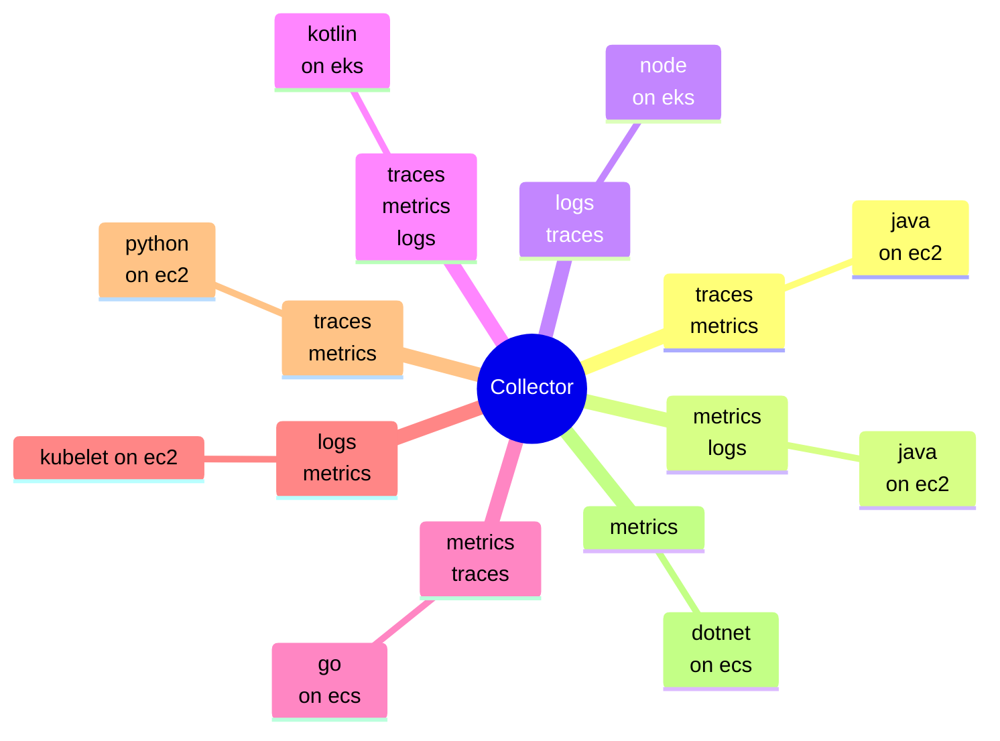
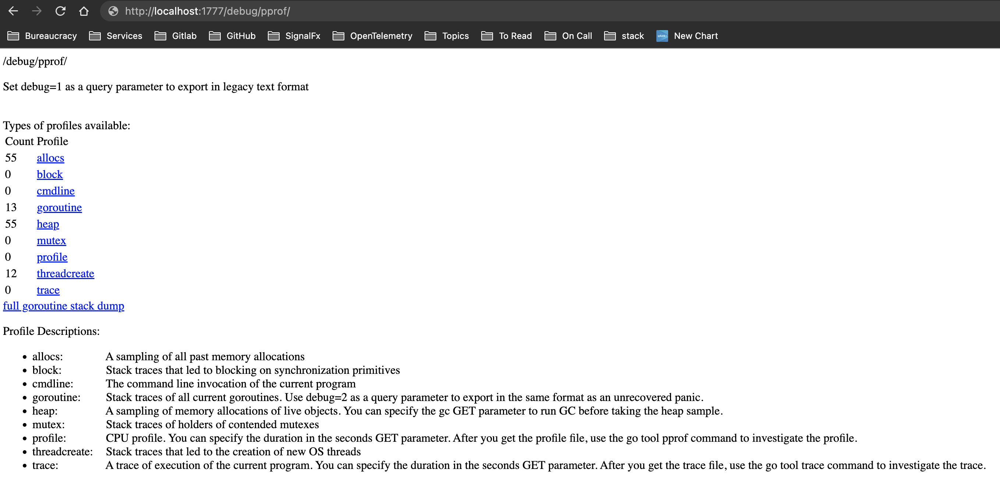
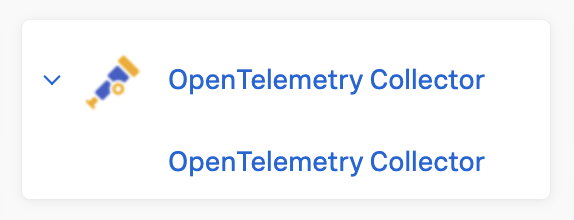
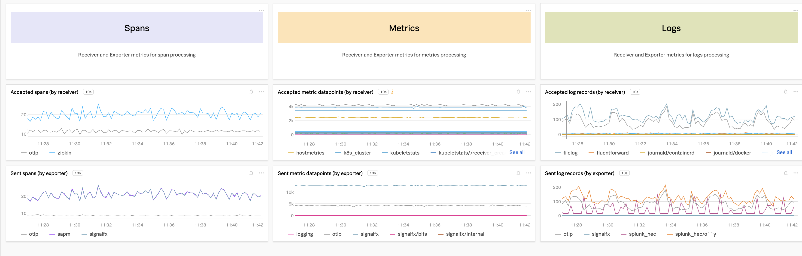

# Splunk OpenTelemetry Collector

### Crash Course

---

## Appeal to authority

"Benchmarks are only as good as the programs they measure." - [Russ Cox](https://go.dev/blog/pprof)

(this may be a deep joke)

## Overview

* i. recap on o11y
* ii. recap on OTel
* I. what's the collector?
* II. what's it do?
* III. do you even collect?

---

## i. Thoughts on "what, where, and how" in observability

my (wrong) hypothesis:

The core of observability is the surfacing (how) of an internal state (what & where) for a given context.


---

*Observability in the field ([source](https://www.splunk.com/en_us/pdfs/resources/e-book/amir-and-the-magical-lens.pdf))*


---

*Pseudocode examples of how, what, and where:*

```
// read the state from a file
state = read({ from: file })
```

```
// write a state delta to some stream
write({
  where: stdout,
  ts: current_time(),
  data: current_state - previous_state,
})
```

---

```
// request the state from some network entity
state = request({
  from: some_entity,
  getter: resp => b64.decode(resp.data["some context"])
})
```

```
// include the state in a response to a request for some context
on_request({
  to: some_context,
  do: (req, resp) => resp.write({ data: not_quite_the_state / 12345.6789 })
})
```

---

The act of surfacing takes many forms, all of which are ~~bitterly~~ inherently context specific.

It will always require a dedicated handle or some adequate proxy (where) for the state to be surfaced.

---

*An example:* 

How long has this system been running?


---

```bash
$ uptime -p
up 7 hours, 12 minutes

$ which uptime && uptime --version
/usr/bin/uptime
uptime from procps-ng 4.0.2
```

---

*From https://gitlab.com/procps-ng/procps/-/blob/master/library/uptime.c*
```c
#define UPTIME_FILE "/proc/uptime"
<...>
(fp = fopen(UPTIME_FILE, "r"))
<...>
rc = fscanf(fp, "%lf %lf", &up, &idle);
```

---

```bash
$ cat /proc/uptime
25969.41 200217.96

$ stat -c '%s %F' /proc/uptime
0 regular empty file

$ findmnt proc
TARGET SOURCE FSTYPE OPTIONS
/proc  proc   proc   rw,nosuid,nodev,noexec,relatim
```

---

*From proc(5) manpage:*
```
# The  proc  filesystem  is  a pseudo-filesystem which provides an interface to kernel data structures.
# <...>
# /proc/uptime
#   This file contains two numbers (values in seconds):
#   the uptime of the system (including time spent in suspend) and the amount of time spent in the idle process.
```

*From https://github.com/torvalds/linux/blob/master/fs/proc/uptime.c*
```c
seq_printf(m, "%lu.%02lu %lu.%02lu\n",
          (unsigned long) uptime.tv_sec,
          (uptime.tv_nsec / (NSEC_PER_SEC / 100)),
          (unsigned long) idle.tv_sec,
          (idle.tv_nsec / (NSEC_PER_SEC / 100)));
```

---


`CLOCK_BOOTTIME` - https://www.man7.org/linux/man-pages/man7/time_namespaces.7.html

`CPUTIME_IDLE` - https://github.com/torvalds/linux/blob/master/include/linux/kernel_stat.h
 - https://github.com/torvalds/linux/blob/master/kernel/sched/cputime.c ???

*https://github.com/torvalds/linux/blob/master/kernel/time/timekeeping.c*
```c
u64 notrace ktime_get_boot_fast_ns(void)
{
	struct timekeeper *tk = &tk_core.timekeeper;

	return (ktime_get_mono_fast_ns() + ktime_to_ns(data_race(tk->offs_boot)));
}
```

--- 

For a given context, observability is zero without a what.

what: the state to surface for a context.

---

For a given context, observability is zero without a where.

where: the location of the state to surface for a context.

Sometimes what and where are the same thing.

---

For a given context, observability is zero without a how...

---

## ii. OpenTelemetry


*What is it? [source](https://opentelemetry.io/)*
* "OpenTelemetry is a collection of APIs, SDKs, and tools."
* "OpenTelemetry is a CNCF incubating project. Formed through a merger of the [OpenTracing](https://opentracing.io/) and [OpenCensus](https://opencensus.io/) projects."

---

OpenTelemetry specifications are maintained here: https://github.com/open-telemetry/opentelemetry-specification/tree/main/specification

In OpenTelemetry there are currently three standardized types of state presentation (telemetry).

*([source](https://imgs.xkcd.com/comics/standards.png))*


---

Their reference implementation, used by effectively all OpenTelemetry libraries, is the OpenTelemetry Protocol (OTLP).

It is located here: https://github.com/open-telemetry/opentelemetry-proto

All of these telemetry types share a metadata envelope called a *Resource* ~defined by
https://github.com/open-telemetry/opentelemetry-proto/blob/main/opentelemetry/proto/resource/v1/resource.proto

```protobuf
message Resource {
  // Set of attributes that describe the resource.
  // Attribute keys MUST be unique (it is not allowed to have more than one
  // attribute with the same key).
  repeated opentelemetry.proto.common.v1.KeyValue attributes = 1;
}
```

*([source](https://github.com/open-telemetry/opentelemetry-proto/blob/main/opentelemetry/proto/trace/v1/trace.proto))*
```
// attributes is a collection of key/value pairs. Note, global attributes
// like server name can be set using the resource API. Examples of attributes:
//
//     "/http/user_agent": "Mozilla/5.0 (Macintosh; Intel Mac OS X 10_14_2) AppleWebKit/537.36 (KHTML, like Gecko) Chrome/71.0.3578.98 Safari/537.36"
//     "/http/server_latency": 300
//     "example.com/myattribute": true
//     "example.com/score": 10.239
//
```

Common types are defined in https://github.com/open-telemetry/opentelemetry-proto/blob/main/opentelemetry/proto/common/v1/common.proto 

```protobuf
message KeyValue {
  string key = 1;
  AnyValue value = 2;
}

message AnyValue {
  oneof value {
    string string_value = 1;
    bool bool_value = 2;
    int64 int_value = 3;
    double double_value = 4;
    ArrayValue array_value = 5;
    KeyValueList kvlist_value = 6;
    bytes bytes_value = 7;
  }
}

message InstrumentationScope {
  string name = 1;
  string version = 2;
  repeated KeyValue attributes = 3;
}
```


---

### [Logs](https://github.com/open-telemetry/oteps/blob/main/text/logs/0097-log-data-model.md)

A representation of instantaneous state ~defined by
https://github.com/open-telemetry/opentelemetry-proto/blob/main/opentelemetry/proto/logs/v1/logs.proto

```protobuf
message LogsData {
  repeated ResourceLogs resource_logs = 1;
}

message ResourceLogs {
  opentelemetry.proto.resource.v1.Resource resource = 1;
  
  repeated ScopeLogs scope_logs = 2;
}

message ScopeLogs {
  opentelemetry.proto.common.v1.InstrumentationScope scope = 1;
  
  repeated LogRecord log_records = 2;
}

message LogRecord {
  fixed64 time_unix_nano = 1;
  fixed64 observed_time_unix_nano = 11;
  SeverityNumber severity_number = 2;
  string severity_text = 3;
  opentelemetry.proto.common.v1.AnyValue body = 5;
  repeated opentelemetry.proto.common.v1.KeyValue attributes = 6;
  fixed32 flags = 8;
  bytes trace_id = 9;
  bytes span_id = 10;
}
```

---

*opentelemetry-python logging example ([source](https://github.com/open-telemetry/opentelemetry-python/blob/main/docs/examples/logs/example.py))*
```python
logger_provider = LoggerProvider(
    resource=Resource.create(
        {
            "service.name": "shoppingcart",
            "service.instance.id": "instance-12",
        }
    ),
)
set_logger_provider(logger_provider)

exporter = OTLPLogExporter(insecure=True)
logger_provider.add_log_record_processor(BatchLogRecordProcessor(exporter))
handler = LoggingHandler(level=logging.NOTSET, logger_provider=logger_provider)

# Attach OTLP handler to root logger
logging.getLogger().addHandler(handler)

# Log directly
logging.info("Jackdaws love my big sphinx of quartz.")

# Create different namespaced loggers
logger1 = logging.getLogger("myapp.area1")
logger2 = logging.getLogger("myapp.area2")

logger1.debug("Quick zephyrs blow, vexing daft Jim.")
logger1.info("How quickly daft jumping zebras vex.")
logger2.warning("Jail zesty vixen who grabbed pay from quack.")
logger2.error("The five boxing wizards jump quickly.")
```

---

### Traces

A graph representation of momentary states ~defined by
https://github.com/open-telemetry/opentelemetry-proto/blob/main/opentelemetry/proto/trace/v1/trace.proto

```protobuf
message TracesData {
  repeated ResourceSpans resource_spans = 1;
}

message ResourceSpans {
  opentelemetry.proto.resource.v1.Resource resource = 1;

  repeated ScopeSpans scope_spans = 2;
}

message ScopeSpans {
  opentelemetry.proto.common.v1.InstrumentationScope scope = 1;

  repeated Span spans = 2;
}

message Span {
  bytes trace_id = 1;
  bytes span_id = 2;
  bytes parent_span_id = 4;
  
  string name = 5;

  enum SpanKind {
    SPAN_KIND_UNSPECIFIED = 0;
    SPAN_KIND_INTERNAL = 1;
    SPAN_KIND_SERVER = 2;
    SPAN_KIND_CLIENT = 3;
    SPAN_KIND_PRODUCER = 4;
    SPAN_KIND_CONSUMER = 5;
  }
  SpanKind kind = 6;

  fixed64 start_time_unix_nano = 7;
  fixed64 end_time_unix_nano = 8;

  repeated opentelemetry.proto.common.v1.KeyValue attributes = 9;

  message Event {
    fixed64 time_unix_nano = 1;
    string name = 2;
    repeated opentelemetry.proto.common.v1.KeyValue attributes = 3;
  }

  repeated Event events = 11;

  message Link {
    bytes trace_id = 1;
    bytes span_id = 2;
    string trace_state = 3;
    repeated opentelemetry.proto.common.v1.KeyValue attributes = 4;
  }
  repeated Link links = 13;

  Status status = 15;
}

message Status {
  string message = 2;
  enum StatusCode {
    STATUS_CODE_UNSET               = 0;
    STATUS_CODE_OK                  = 1;
    STATUS_CODE_ERROR               = 2;
  };

  StatusCode code = 3;
}
```

---

*opentelemetry-python tracing example ([source](https://github.com/open-telemetry/opentelemetry-python/blob/main/docs/examples/basic_tracer/basic_trace.py))*
```python
from opentelemetry import trace
from opentelemetry.sdk.trace import TracerProvider
from opentelemetry.sdk.trace.export import (
    BatchSpanProcessor,
    ConsoleSpanExporter,
)

trace.set_tracer_provider(TracerProvider())
trace.get_tracer_provider().add_span_processor(
    BatchSpanProcessor(ConsoleSpanExporter())
)

tracer = trace.get_tracer(__name__)
with tracer.start_as_current_span("foo"):
    print("Hello world!")
```

---

### Metrics

A numeric representation of instantaneous state ~defined by
https://github.com/open-telemetry/opentelemetry-proto/blob/main/opentelemetry/proto/metrics/v1/metrics.proto

```protobuf
message MetricsData {
  repeated ResourceMetrics resource_metrics = 1;
}

message ResourceMetrics {
  opentelemetry.proto.resource.v1.Resource resource = 1;
  
  repeated ScopeMetrics scope_metrics = 2;
}

message ScopeMetrics {
  opentelemetry.proto.common.v1.InstrumentationScope scope = 1;
  
  repeated Metric metrics = 2;
}

message Metric {
  string name = 1;
  string description = 2;
  string unit = 3;
  
  oneof data {
    Gauge gauge = 5;
    Sum sum = 7;
    Histogram histogram = 9;
    ExponentialHistogram exponential_histogram = 10;
    Summary summary = 11;
  }
}

message Gauge {
  repeated NumberDataPoint data_points = 1;
}

message Sum {
  repeated NumberDataPoint data_points = 1;

  AggregationTemporality aggregation_temporality = 2;
  
  bool is_monotonic = 3;
}

message Histogram {
  repeated HistogramDataPoint data_points = 1;

  AggregationTemporality aggregation_temporality = 2;
}

message ExponentialHistogram {
  repeated ExponentialHistogramDataPoint data_points = 1;

  AggregationTemporality aggregation_temporality = 2;
}

message Summary {
  repeated SummaryDataPoint data_points = 1;
}

enum AggregationTemporality {
  // UNSPECIFIED is the default AggregationTemporality, it MUST not be used.
  AGGREGATION_TEMPORALITY_UNSPECIFIED = 0;

  // DELTA is an AggregationTemporality for a metric aggregator which reports
  // changes since last report time. Successive metrics contain aggregation of
  // values from continuous and non-overlapping intervals.
  AGGREGATION_TEMPORALITY_DELTA = 1;

  // CUMULATIVE is an AggregationTemporality for a metric aggregator which
  // reports changes since a fixed start time. 
  AGGREGATION_TEMPORALITY_CUMULATIVE = 2;
}

message NumberDataPoint {
  repeated opentelemetry.proto.common.v1.KeyValue attributes = 7;

  // StartTimeUnixNano in general allows detecting when a sequence of
  // observations is unbroken.  This field indicates to consumers the
  // start time for points with cumulative and delta
  fixed64 start_time_unix_nano = 2;

  fixed64 time_unix_nano = 3;

  oneof value {
    double as_double = 4;
    sfixed64 as_int = 6;
  }
}

```

---

*opentelemetry-python metrics example ([source](https://github.com/open-telemetry/opentelemetry-python/blob/main/docs/examples/metrics/instruments/example.py))*
```python
from opentelemetry.exporter.otlp.proto.grpc.metric_exporter import (
    OTLPMetricExporter,
)
from opentelemetry.metrics import (
    get_meter_provider,
    set_meter_provider,
)
from opentelemetry.sdk.metrics import MeterProvider
from opentelemetry.sdk.metrics.export import PeriodicExportingMetricReader

exporter = OTLPMetricExporter(insecure=True)
reader = PeriodicExportingMetricReader(exporter)
provider = MeterProvider(metric_readers=[reader])
set_meter_provider(provider)

meter = get_meter_provider().get_meter("getting-started", "0.1.2")

counter = meter.create_counter("counter")
counter.add(1)
```

---

There are APIs and SDKs for a lot of languages, including auto-instrumentation offerings for many client and server libraries.

* opentelemetry-cpp
* opentelemetry-cpp-contrib
* opentelemetry-dotnet
* opentelemetry-dotnet-instrumentation
* opentelemetry-epbf
* opentelemetry-erlang
* opentelemetry-erlang-contrib
* opentelemetry-go
* opentelemetry-go-contrib
* opentelemetry-go-instrumentation
* opentelemetry-java
* opentelemetry-java-contrib
* opentelemetry-java-instrumentation
* opentelemetry-js
* opentelemetry-js-contrib
* opentelemetry-php
* opentelemetry-php-contrib
* opentelemetry-php-instrumentation
* opentelemetry-python
* opentelemetry-python-contrib
* opentelemetry-ruby
* opentelemetry-ruby-contrib 
* opentelemetry-rust
* opentelemetry-swift

---

There are also cases of first-class adoption in major applications:

* [kubernetes](https://kubernetes.io/docs/concepts/cluster-administration/system-traces/)
* [docker](https://docs.docker.com/build/building/opentelemetry/)
* [cri-o](https://github.com/cri-o/cri-o/pull/4883)
* [containerd](https://github.com/containerd/containerd/blob/main/docs/tracing.md)

---

Despite the large selection of instrumentation offerings, the export protocol options are limited to pretty much OTLP (or prometheus).

This is good for users in avoiding vendor lock-in while adopting OTel dependenciees in their applications.

But this is limiting for them in reporting options.

It also creates a scenario where all telemetry reporters would need specialized configuration and handling of the telemetry to be accessible.

---

## I. The Collector



---

The OpenTelemetry Collector is an effort to provide and support a unified interface to functionality built from new and existing OSS libraries for:

1. Receiving/gathering state from specific and arbitrary sources (targets and protocols)
2. Sending/exposing state to specific and arbitrary sources (targets and protocols)

---

It is a standalone application, a service framework, and collection of component libraries for adoption in custom distributions or arbitrary Go programs.

The core source is located here https://github.com/open-telemetry/opentelemetry-collector 

---

There is a community contributions project and distribution that "wrap" the core project and includes third-party library/target services and vendor-compatible components.

The contrib source is located here: https://github.com/open-telemetry/opentelemetry-collector-contrib

---

Both have releases maintained here: https://github.com/open-telemetry/opentelemetry-collector-releases

---

The collector could be thought of a widely scalable method of providing how, what, and where for small to massive deployments.

It does this by:

*CRUD-ing telemetry*

---

### create

*host metrics receiver ([source](https://github.com/open-telemetry/opentelemetry-collector-contrib/blob/main/receiver/hostmetricsreceiver/internal/scraper/processscraper/internal/metadata/generated_metrics.go))*

```go
func (m *metricProcessCPUTime) init() {
    m.data.SetName("process.cpu.time")
    m.data.SetDescription("Total CPU seconds broken down by different states.")
    m.data.SetUnit("s")
    m.data.SetEmptySum()
    m.data.Sum().SetIsMonotonic(true)
    m.data.Sum().SetAggregationTemporality(pmetric.AggregationTemporalityCumulative)
    m.data.Sum().DataPoints().EnsureCapacity(m.capacity)
}

func (m *metricProcessCPUTime) recordDataPoint(start pcommon.Timestamp, ts pcommon.Timestamp, val float64, stateAttributeValue string) {
    if !m.config.Enabled {
        return
    }
    dp := m.data.Sum().DataPoints().AppendEmpty()
    dp.SetStartTimestamp(start)
    dp.SetTimestamp(ts)
    dp.SetDoubleValue(val)
    dp.Attributes().PutStr("state", stateAttributeValue)
}
```

---

### read

*signalfx receiver ([source](https://github.com/open-telemetry/opentelemetry-collector-contrib/blob/main/receiver/signalfxreceiver/receiver.go))*

```go
func (r *sfxReceiver) handleDatapointReq(resp http.ResponseWriter, req *http.Request) {
    <...>

    body, ok := r.readBody(ctx, resp, req)
    if !ok {
        return
    }

    msg := &sfxpb.DataPointUploadMessage{}
    if err := msg.Unmarshal(body); err != nil {
        r.failRequest(ctx, resp, http.StatusBadRequest, errUnmarshalBodyRespBody, err)
        return
    }

    <...>

    md, err := translator.ToMetrics(msg.Datapoints)
    if err != nil {
        r.settings.Logger.Debug("SignalFx conversion error", zap.Error(err))
    }

    <...>
}
```

---

### update

*resource detection processor ([source](https://github.com/open-telemetry/opentelemetry-collector-contrib/blob/main/processor/resourcedetectionprocessor/internal/system/system.go) and [source](https://github.com/open-telemetry/opentelemetry-collector-contrib/blob/main/processor/resourcedetectionprocessor/internal/resourcedetection.go))*

```go
for _, source := range d.hostnameSources {
    getHostFromSource := hostnameSourcesMap[source]
    hostname, err = getHostFromSource(d)
    if err == nil {
        attrs.PutStr(conventions.AttributeHostName, hostname)
        attrs.PutStr(conventions.AttributeOSType, osType)
        attrs.PutStr(conventions.AttributeHostID, hostID)

        return res, conventions.SchemaURL, nil
    }
    d.logger.Debug(err.Error())
}
````

---

```go
toAttr := to.Attributes()
from.Attributes().Range(func(k string, v pcommon.Value) bool {
    if overrideTo {
        v.CopyTo(toAttr.PutEmpty(k))
    } else {
        if _, found := toAttr.Get(k); !found {
            v.CopyTo(toAttr.PutEmpty(k))
        }
    }
    return true
})
```

---

### delete

*filter processor ([source](https://github.com/open-telemetry/opentelemetry-collector-contrib/blob/main/processor/filterprocessor/traces.go))*

```go
td.ResourceSpans().RemoveIf(func(rs ptrace.ResourceSpans) bool {
    resource := rs.Resource()
    rs.ScopeSpans().RemoveIf(func(ss ptrace.ScopeSpans) bool {
        scope := ss.Scope()
        ss.Spans().RemoveIf(func(span ptrace.Span) bool {
            if fsp.skipSpanExpr != nil {
                skip, err := fsp.skipSpanExpr.Eval(ctx, ottlspan.NewTransformContext(span, scope, resource))
                if err != nil {
                    errors = multierr.Append(errors, err)
                    return false
                }
                if skip {
                    return true
                }
            }
            if fsp.skipSpanEventExpr != nil {
                span.Events().RemoveIf(func(spanEvent ptrace.SpanEvent) bool {
                    skip, err := fsp.skipSpanEventExpr.Eval(ctx, ottlspanevent.NewTransformContext(spanEvent, span, scope, resource))
                    if err != nil {
                        errors = multierr.Append(errors, err)
                        return false
                    }
                    return skip
                })
            }
            return false
        })
        return ss.Spans().Len() == 0
    })
    return rs.ScopeSpans().Len() == 0
})
```

---

**The collector could be thought of a widely scalable method of providing how, what, and where for small to massive deployments.**

It also does this by:

*Sending telemetry (...to another collector, Splunk Observability Cloud, Splunk Cloud Platform, etc...)*

*otlp http exporter ([source](https://github.com/open-telemetry/opentelemetry-collector/blob/main/exporter/otlphttpexporter/otlp.go))*

```go
func (e *baseExporter) export(ctx context.Context, url string, request []byte, partialSuccessHandler partialSuccessHandler) error {
    e.logger.Debug("Preparing to make HTTP request", zap.String("url", url))
    req, err := http.NewRequestWithContext(ctx, http.MethodPost, url, bytes.NewReader(request))
    if err != nil {
        return consumererror.NewPermanent(err)
    }
    req.Header.Set("Content-Type", "application/x-protobuf")
    req.Header.Set("User-Agent", e.userAgent)

    resp, err := e.client.Do(req)
    if err != nil {
        return fmt.Errorf("failed to make an HTTP request: %w", err)
    }

    <...>
```

---

Its core runtime is a service that:
* resolves configuration content
* manages configured components' lifecycles
* maintains internal telemetry
* provides a feature gate registry for (dis/en)abling bw-incompatible functionality
* other things...

---

Most of this functionality is exposed to an end user by configuring components and service pipelines:

*A pipeline diagram ([source](https://github.com/open-telemetry/opentelemetry-collector/blob/main/docs/design.md))*


*A service configuration ([source](https://github.com/open-telemetry/opentelemetry-collector/blob/main/docs/design.md))*


---

### The Splunk Distribution of OpenTelemetry Collector

The Splunk Distribution of OpenTelemetry Collector is a custom distribution of the collector that:
* includes "curated" core and contrib elements
* includes Splunk user-centered functionality:
  * installer support
  * the Smart Agent and other receivers
  * config sources
  * discovery mode (new)

---

Its source is located here: https://github.com/signalfx/splunk-otel-collector

The definitive list of included components is here: https://github.com/signalfx/splunk-otel-collector/blob/main/docs/components.md

(but the source of truth is here: https://github.com/signalfx/splunk-otel-collector/blob/main/internal/components/components.go)

---

The basis of the Splunk OpenTelemetry Collector distributable is the `otelcol(.exe)` executable built from that project.

The Splunk distribution releases this executable along with most of its runtime dependencies and default configuration(s) via various installation methods package repositories.

---

*Contrib - Splunk distro comparison ([source](https://docs.splunk.com/observability/gdi/other-ingestion-methods/upstream-collector.html))*


---

This distribution is intended to run in the same environments our customers run their applications. It offers the following packaging and service runtime methods (described in more detail later).

* executable
  * linux - amd64, arm64, ppc64le
  * windows - amd64
  * darwin - amd64, arm64
* .tar.gz
  * linux - amd64, arm64
* deb (amd64, arm64)
* rpm (amd64, arm64)
* Docker image
  * linux - amd64, arm64, ppc64le
  * windows - 2019, 2022 (amd64)

---

## II. Functionality

The collector is a collection of components, each conforming to a type with a limited interface.

~All components that deal directly with telemetry will do so in the internal intermediate form called [pdata](https://github.com/open-telemetry/opentelemetry-collector/tree/main/pdata) (shown above in CRUD examples).

pdata is effectively a set of convenience methods on the generated OTLP library for go, so again an intuition about OTLP is very helpful in understanding what the collector does.

---

### Configuration

All of the subsequent components are dynamically instantiated based on config content.

Except for implementation flow and internal service-level bits, effectively all expected functionality for a collector session is heavily influenced by its configuration.

In this way, collector configuration can be thought of as a DSL. 

---

#### YAML

Collector configuration is specified in yaml (spec [located here](https://yaml.org/spec/1.2.2/)).

It's often mentioned that yaml is a superset of json, which can be a helpful way of thinking about it.

```json
{"one":1,"two":2,"three":false,"four":null}
```

```yaml
one: 1
two: 2
three: false
four: null
```

---

The highest level value types in yaml are nodes: https://yaml.org/spec/1.2.2/#3211-nodes

##### Scalar

```yaml
"a string scalar"
```

```yaml
123.456
```

```yaml
false
```

##### Sequence

```yaml
[a, string, sequence]
```

##### Mapping

```yaml
a string: mapping
```

---

```yaml
mapping:
  - scalar sequence item (implicit string)
  # a comment
  - "another scalar sequence item"
  - another: mapping
    as a sequence item: true
  # below is a float
  - 1.234
  # below is a string
  - 1.234.567
  # below is null
  - null
  # below is implicit null
  -
  # below is empty string
  - ""
  # below is false
  - false
  # below is an empty object
  - {}
  # below is a tag to express null as a string
  - !!str null
still part of the mapping: true
```

---

A helpful tool for yaml validation: https://www.yamllint.com/

Helpful block and flow scalar examples: https://yaml-multiline.info/

---

The core collector service uses "gopkg.in/yaml.v3" for parsing yaml and decoding it into internal structures.

```go
import (
	"fmt"

	"gopkg.in/yaml.v3"
)

func main() {
    someYaml := "<...from above...>"
    decoded := map[string]any{}
    if err := yaml.Unmarshal([]byte(someYaml), &decoded); err != nil {
        panic(err)
    }
    fmt.Printf("yaml: %v\n", decoded)
}
```

```bash
yaml: map[mapping:[scalar sequence item (implicit string) another scalar sequence item map[another:mapping as a sequence item:true] 1.234 1.234.567 <nil> <nil>  false map[] null] still part of the mapping:true]
```

---

A similar thing occurs during configuration loading, using a `file` confmap.Provider: https://github.com/open-telemetry/opentelemetry-collector/tree/main/confmap/provider.

On startup, the config is loaded from a path then its contents are routed to the specified component factories for validation and instantiation.

```bash
$ cat /my/config.yaml
extensions:
  health_check:
receivers:
  otlp:
    protocols:
      http:
exporters:
  logging:
service:
  extensions: [health_check]
  pipelines:
    metrics:
      receivers: [otlp]
      exporters: [logging]

$ otelcol --config file:/my/config.yaml --dry-run
exporters:
  logging: null
extensions:
  health_check: null
receivers:
  otlp:
    protocols:
      http: null
service:
  extensions:
  - health_check
  pipelines:
    metrics:
      exporters:
      - logging
      receivers:
      - otlp
```

---

#### Component configuration

```yaml
<component kind>s:
  <component-id>: # <component-type></component-instance-name>
      config mapping: content
```

---

```yaml
exporters:
  signalfx/my-signalfx-exporter-name:
    access_token: "${SPLUNK_ACCESS_TOKEN}"
    api_url: "${SPLUNK_API_URL}"
    ingest_url: "${SPLUNK_INGEST_URL}"
    # Use instead when sending to gateway
    #api_url: http://${SPLUNK_GATEWAY_URL}:6060
    #ingest_url: http://${SPLUNK_GATEWAY_URL}:9943
    sync_host_metadata: true
    correlation:
```

---

*signalfx exporter config ([source](https://github.com/open-telemetry/opentelemetry-collector-contrib/blob/main/exporter/signalfxexporter/config.go))*
```go
// Config defines configuration for SignalFx exporter.
type Config struct {
	<...>
	// AccessToken is the authentication token provided by SignalFx.
	AccessToken configopaque.String `mapstructure:"access_token"`

	<...>
	// IngestURL is the destination to where SignalFx metrics will be sent to, it is
	// intended for tests and debugging. The value of Realm is ignored if the
	// URL is specified. The exporter will automatically append the appropriate
	// path: "/v2/datapoint" for metrics, and "/v2/event" for events.
	IngestURL string `mapstructure:"ingest_url"`

	<...>
	// APIURL is the destination to where SignalFx metadata will be sent. This
	// value takes precedence over the value of Realm
	APIURL string `mapstructure:"api_url"`

	<...>
	// SyncHostMetadata defines if the exporter should scrape host metadata and
	// sends it as property updates to SignalFx backend.
	// IMPORTANT: Host metadata synchronization relies on `resourcedetection` processor.
	//            If this option is enabled make sure that `resourcedetection` processor
	//            is enabled in the pipeline with one of the cloud provider detectors
	//            or environment variable detector setting a unique value to
	//            `host.name` attribute within your k8s cluster. Also keep override
	//            And keep `override=true` in resourcedetection config.
	SyncHostMetadata bool `mapstructure:"sync_host_metadata"`

	<...>
	// Correlation configuration for syncing traces service and environment to metrics.
	Correlation *correlation.Config `mapstructure:"correlation"`
}
```

---

### [Receivers](https://github.com/open-telemetry/opentelemetry-collector/blob/main/receiver/README.md)

Receivers are the main creators of telemetry in the collector and can do so either by push or pull methods.
Those that don't listen to a socket are likely [scrapers](https://github.com/open-telemetry/opentelemetry-collector/blob/main/receiver/scraperhelper/scraper.go).

---

#### metadata.yaml

The [metadata generator](https://github.com/open-telemetry/opentelemetry-collector-contrib/tree/main/cmd/mdatagen) is a helper utility in the collector contrib project.

It reduces the need to have repeated code and boilerplate for common scraping patterns in receivers.

Most scrapers will have a `metadata.yaml` file in their module root that contains information about the component, their expected resource and other attributes, and the metrics they create.


*Kubelet Stats receiver metadata.yaml snippet ([source](https://github.com/open-telemetry/opentelemetry-collector-contrib/blob/main/receiver/kubeletstatsreceiver/metadata.yaml))*
```yaml
type: kubeletstats

status:
  class: receiver
  stability:
    beta: [metrics]

resource_attributes:
  k8s.pod.uid:
    description: "The UID of the Pod"
    enabled: true
    type: string

# <...>

attributes:
  interface:
    description: Name of the network interface.
    type: string
    
# <...>

metrics:
  # <...>
  container.cpu.time:
    enabled: true
    description: "Container CPU time"
    unit: s
    sum:
      value_type: double
      monotonic: true
      aggregation: cumulative
    attributes: [ ]
```

Which when read by mdatagen will generate helper methods for building metrics with the specific metric metadata.

```go
// kubelet stats specific metric gathering
func addCPUTimeMetric(mb *metadata.MetricsBuilder, recordDataPoint metadata.RecordDoubleDataPointFunc, s *stats.CPUStats, currentTime pcommon.Timestamp) {
  if s.UsageCoreNanoSeconds == nil {
    return
  }
  value := float64(*s.UsageCoreNanoSeconds) / 1_000_000_000
  recordDataPoint(mb, currentTime, value)
}

// invokes mdatagen generated recordDataPoint function:
func (m *metricContainerCPUTime) recordDataPoint(start pcommon.Timestamp, ts pcommon.Timestamp, val float64) {
	if !m.config.Enabled {
		return
	}
	dp := m.data.Sum().DataPoints().AppendEmpty()
	dp.SetStartTimestamp(start)
	dp.SetTimestamp(ts)
	dp.SetDoubleValue(val)
}
```

There is currently an effort to incorporate metadata.yaml into product docs for more up to date and reliable information: https://github.com/splunk/collector-config-tools

---
#### Host metrics receiver

https://github.com/open-telemetry/opentelemetry-collector-contrib/blob/main/receiver/hostmetricsreceiver

The host metrics receiver is a scraper receiver that will scrape platform-specific state targets based on the configured scrapers.

```yaml
hostmetrics:
  collection_interval: 10s
  scrapers:
    cpu:
    disk:
    filesystem:
    memory:
    network:
    load:
    paging:
    processes:
    process:
```

---
#### Smart Agent receiver

The Smart Agent receiver provides legacy Smart Agent monitors to run in the Splunk distribution.

The underlying type class (native go, native collectd, collectd-python) of the monitor is very significant and supported platforms are largely inherited from the agent monitors.

Collectd and collectd-python monitors require the "agent bundle", which is provided only for linux and Windows (no collectd) installations.

```yaml
receivers:
  # native collectd
  smartagent/collectd_apache:
    type: collectd/apache
    host: localhost
    port: 8080
    intervalSeconds: 10
  # collectd-python
  smartagent/collectd_elasticsearch:
    type: collectd/elasticsearch
    host: localhost
    port: 9200
    username: elastic
    password: testing123
    extraMetrics: ["*"]
  # native go
  smartagent/postgresql:
    type: postgresql
    host: localhost
    port: 5432
    connectionString: 'sslmode=disable user={{.username}} password={{.password}}'
    params:
      username: ${env:USERNAME}
      password: ${env:PASSWORD}
    masterDBName: test_db
```

---

#### Kubelet Stats receiver

https://github.com/open-telemetry/opentelemetry-collector-contrib/tree/main/receiver/kubeletstatsreceiver

This receiver generates metrics based on a node's kubelet's `/stats/summary` endpoint:

```
bash-4.4# export TOKEN=$(cat /var/run/secrets/kubernetes.io/serviceaccount/token)
bash-4.4# curl --cacert /var/run/secrets/kubernetes.io/serviceaccount/ca.crt  --header "Authorization: Bearer ${TOKEN}" "https://${K8S_NODE_IP}:10250/stats/summary"
{
 "node": {
  "nodeName": "ip-10-4-70-86.ec2.internal",
  "systemContainers": [
   {
    "name": "kubelet",
    "startTime": "2023-07-07T21:57:19Z",
    "cpu": {
     "time": "2023-07-13T13:09:44Z",
     "usageNanoCores": 66454521,
     "usageCoreNanoSeconds": 27838361669889
    },
    "memory": {
     "time": "2023-07-13T13:09:44Z",
     "usageBytes": 232452096,
     "workingSetBytes": 232452096,
     "rssBytes": 85123072,
     "pageFaults": 213215013,
     "majorPageFaults": 264
    }
   },
  ],
  <...>
```

---

#### Kubernetes Cluster receiver

https://github.com/open-telemetry/opentelemetry-collector-contrib/tree/main/receiver/k8sclusterreceiver

This receiver generates metrics based on object events from the cluster's api server.

```go

func (rw *resourceWatcher) onAdd(obj interface{}) {
    // <...>
    rw.dataCollector.SyncMetrics(obj)
    // <...>
}

func (rw *resourceWatcher) onDelete(obj interface{}) {
    // <...>
    rw.dataCollector.RemoveFromMetricsStore(obj)
    // <...>
}

func (rw *resourceWatcher) onUpdate(oldObj, newObj interface{}) {
	// <...>
    rw.dataCollector.SyncMetrics(newObj)
    // <...>
}
```

```go
// SyncMetrics updates the metric store with latest metrics from the kubernetes object.
func (dc *DataCollector) SyncMetrics(obj interface{}) {
    var md pmetric.Metrics
    
    switch o := obj.(type) {
        case *corev1.Pod:
            md = pod.GetMetrics(dc.settings, o)
        case *corev1.Node:
            md = node.GetMetrics(dc.settings, o, dc.nodeConditionsToReport, dc.allocatableTypesToReport)
        case *corev1.Namespace:
            md = namespace.GetMetrics(dc.settings, o)
        case *corev1.ReplicationController:
            md = ocsToMetrics(replicationcontroller.GetMetrics(o))
        case *corev1.ResourceQuota:
            md = resourcequota.GetMetrics(dc.settings, o)
        case *appsv1.Deployment:
            md = deployment.GetMetrics(dc.settings, o)
        case *appsv1.ReplicaSet:
            md = ocsToMetrics(replicaset.GetMetrics(o))
        case *appsv1.DaemonSet:
            md = ocsToMetrics(demonset.GetMetrics(o))
        case *appsv1.StatefulSet:
            md = statefulset.GetMetrics(dc.settings, o)
        case *batchv1.Job:
            md = ocsToMetrics(jobs.GetMetrics(o))
        case *batchv1.CronJob:
            md = ocsToMetrics(cronjob.GetMetrics(o))
        case *batchv1beta1.CronJob:
            md = ocsToMetrics(cronjob.GetMetricsBeta(o))
        case *autoscalingv2.HorizontalPodAutoscaler:
            md = hpa.GetMetrics(dc.settings, o)
        case *autoscalingv2beta2.HorizontalPodAutoscaler:
            md = hpa.GetMetricsBeta(dc.settings, o)
        case *quotav1.ClusterResourceQuota:
            md = ocsToMetrics(clusterresourcequota.GetMetrics(o))
        default:
          return
    }
    
    if md.DataPointCount() == 0 {
      return
    }
    
    dc.UpdateMetricsStore(obj, md)
}
```

---

#### Prometheus Receiver

This receiver embeds the main functionality of a prometheus server's scrape logic in the collector.

It supports the majority of its scrape config:https://prometheus.io/docs/prometheus/latest/configuration/configuration/#scrape_config

```yaml
prometheus/internal:
  config:
    scrape_configs:
      - job_name: 'otel-collector'
        scrape_interval: 10s
        static_configs:
          - targets: ['0.0.0.0:8888']
```

There's a simpler wrapper for this receiver when the complete prometheus config support isn't needed (but k8s service account support is):

https://github.com/open-telemetry/opentelemetry-collector-contrib/tree/main/receiver/simpleprometheusreceiver

There are known, and potentially serious, resource requirement issues for this receiver. A less capable but more performant version is in the Splunk distribution:

https://github.com/signalfx/splunk-otel-collector/tree/main/internal/receiver/lightprometheusreceiver

---

#### Filelog Receiver

The filelog receiver is a highly configurable file reader and content parser for constructing logs:

https://github.com/open-telemetry/opentelemetry-collector-contrib/tree/main/receiver/filelogreceiver

```yaml
extensions:
  file_storage:
    directory: /tmp/log_storage

receivers:
  filelog:
    include: [ /var/logs/*.log ]
    operators:
      - type: regex_parser
        regex: '^(?P<time>\d{4}-\d{2}-\d{2} \d{2}:\d{2}:\d{2}) (?P<sev>[A-Z]*) (?P<msg>.*)$'
        timestamp:
          parse_from: attributes.time
          layout: '%Y-%m-%d %H:%M:%S'
        severity:
          parse_from: attributes.sev
    storage: file_storage
```

Operators are documented here: https://github.com/open-telemetry/opentelemetry-collector-contrib/tree/main/pkg/stanza/docs/operators

Parsers (operators) are documented here: https://github.com/open-telemetry/opentelemetry-collector-contrib/blob/main/pkg/stanza/docs/types/parsers.md

```yaml
# Regex parser with embedded timestamp and severity parsers
- type: json_parser
  timestamp:
    parse_from: attributes.ts
    layout_type: strptime
    layout: '%Y-%m-%d'
  severity:
    parse_from: attributes.sev
```

---

### Exporters

Exporters are the reporters of telemetry and are pretty much the only way it can leave the collector process.
They consume pdata from receivers, processors, or connectors.

---

#### Logging Exporter

https://github.com/open-telemetry/opentelemetry-collector/tree/main/exporter/loggingexporter

The logging exporter will 


```yaml
exporters:
  logging:
    verbosity: detailed
    sampling_initial: 5 # default 2 - messages logged each second
    sampling_thereafter: 200 # default 500 - every nth message will be logged per second after initial sample
```

w/ default verbosity (`"normal"`)

```bash
info	MetricsExporter	{"kind": "exporter", "data_type": "metrics", "name": "logging", "resource metrics": 1, "metrics": 1, "data points": 64}
```

`verbosity: detailed`

```bash
info	ResourceMetrics #0
Resource SchemaURL: https://opentelemetry.io/schemas/1.9.0
ScopeMetrics #0
ScopeMetrics SchemaURL:
InstrumentationScope otelcol/hostmetricsreceiver/cpu v0.80.0
Metric #0
Descriptor:
     -> Name: system.cpu.time
     -> Description: Total CPU seconds broken down by different states.
     -> Unit: s
     -> DataType: Sum
     -> IsMonotonic: true
     -> AggregationTemporality: Cumulative
NumberDataPoints #0
Data point attributes:
     -> cpu: Str(cpu0)
     -> state: Str(user)
StartTimestamp: 2023-07-12 12:21:43 +0000 UTC
Timestamp: 2023-07-12 15:05:42.935707246 +0000 UTC
Value: 2.150000
NumberDataPoints #1
Data point attributes:
     -> cpu: Str(cpu0)
     -> state: Str(system)
```

---

#### Exporter Helper

https://github.com/open-telemetry/opentelemetry-collector/blob/main/exporter/exporterhelper/README.md

Provides common queuing and retry mechanisms to any adopting exporter (most):

```yaml
exporters:
  exporter:
    retry_on_failure:
      enabled: true
      initial_interval: 5s
      max_interval: 30s
    sending_queue:
      enabled: true
      num_consumers: 10
      queue_size: 1000
```

#### OTLP Exporter

https://github.com/open-telemetry/opentelemetry-collector/tree/main/exporter/otlpexporter

Exports OTLP (gRPC only).

```yaml
exporters:
  otlp:
    endpoint: otelcol2:4317
    tls:
      cert_file: file.cert
      key_file: file.key
```

---

#### OTLP/HTTP Exporter

https://github.com/open-telemetry/opentelemetry-collector/tree/main/exporter/otlphttpexporter

Exports OTLP to http endpoints.

```yaml
exporters:
  otlphttp:
    endpoint: https://collector:4318
```

---

#### SignalFx Exporter

https://github.com/open-telemetry/opentelemetry-collector-contrib/tree/main/exporter/signalfxexporter

Unfortunately this is a pretty complicated exporter that mirrors semantic and processing practices for O11y cloud.

By default it maintains bw-compatible metrics from the host metrics, kubelet, and k8s cluster receivers w/ what the Smart Agent reports.

It does this through a translation capability w/ dsl:

https://github.com/open-telemetry/opentelemetry-collector-contrib/blob/main/exporter/signalfxexporter/internal/translation/constants.go

```yaml
translation_rules:
- action: copy_metrics
  mapping:
    # kubeletstats container cpu needed for calculation below
    container.cpu.time: sf_temp.container_cpu_utilization

- action: multiply_float
  scale_factors_float:
    sf_temp.container_cpu_utilization: 100
    
- action: convert_values
  types_mapping:
    sf_temp.container_cpu_utilization: int
    
- action: rename_metrics
  mapping:
    sf_temp.container_cpu_utilization: container_cpu_utilization
```

And by dropping "undesired" metrics by default.

https://github.com/open-telemetry/opentelemetry-collector-contrib/blob/main/exporter/signalfxexporter/internal/translation/default_metrics.go

```yaml
exclude_metrics:
# Metrics in SignalFx Agent Format.
- metric_names:
  # CPU metrics.
  # Derived from https://docs.signalfx.com/en/latest/integrations/agent/monitors/cpu.html.
  - cpu.interrupt
  - cpu.nice
  - cpu.softirq
  - cpu.steal
  - cpu.system
  - cpu.user
  - cpu.utilization_per_core
  - cpu.wait
```


These can be overridden entirely, or modified w/ additive `include_metrics` rules:
```yaml
include_metrics:
  # When sending in translated metrics.
  - metric_names: [cpu.interrupt, cpu.user, cpu.system]
  # When sending in metrics in OTel convention.
  - metric_name: system.cpu.time
    dimensions:
      state: [interrupt, user, system]
```

If used in traces pipeline it provides trace correlation functionality (correlates instance details by deployment or environment span attributes)

If used in a logs pipeline it will send properly formatted log records as SignalFx/O11y metric events.

---

#### SAPM Exporter

https://github.com/open-telemetry/opentelemetry-collector-contrib/tree/main/exporter/sapmexporter

This sends traces in a legacy apm format (gzipped jaeger).

---

#### Splunk HEC Exporter

https://github.com/open-telemetry/opentelemetry-collector-contrib/tree/main/exporter/splunkhecexporter

Supports metrics, traces, and logs, as well as required for Profiling.

---

### Processors

Processors consume telemetry from receivers, other processors, or connections in a pipeline, modifying and batching as necessary.

#### Filter processor

https://github.com/open-telemetry/opentelemetry-collector-contrib/tree/main/processor/filterprocessor

Will drop telemetry from the pipeline if its configured [ottl expressions](https://github.com/open-telemetry/opentelemetry-collector-contrib/blob/main/pkg/ottl/README.md) are evaluated as true.

```yaml
processors:
  filter/ottl:
    error_mode: ignore
    traces:
      span:
        - 'attributes["container.name"] == "app_container_1"'
        - 'resource.attributes["host.name"] == "localhost"'
        - 'name == "app_3"'
      spanevent:
        - 'attributes["grpc"] == true'
        - 'IsMatch(name, ".*grpc.*")'
    metrics:
      metric:
          - 'name == "my.metric" and resource.attributes["my_label"] == "abc123"'
          - 'type == METRIC_DATA_TYPE_HISTOGRAM'
      datapoint:
          - 'metric.type == METRIC_DATA_TYPE_SUMMARY'
          - 'resource.attributes["service.name"] == "my_service_name"'
    logs:
      log_record:
        - 'IsMatch(body, ".*password.*")'
        - 'severity_number < SEVERITY_NUMBER_WARN'
```

---

#### Memory limiter processor

https://github.com/open-telemetry/opentelemetry-collector/tree/main/processor/memorylimiterprocessor

The memory limiter will check the current collector memory utilization and refuse all telemetry if over the configured hard limit.

It also performs garbage collection in this case in an attempt to free memory.

```yaml
processors:
  memory_limiter:
    check_interval: 1s
    limit_mib: 4000
```

---

### Pipelines

Pipelines are a service-level component that determine who consumes pdata from whom. All components can be used in an arbitrary number of pipelines.

```yaml
service:
  extensions: [health_check, http_forwarder, zpages, memory_ballast, smartagent]
  pipelines:
    traces:
      receivers: [jaeger, otlp, smartagent/signalfx-forwarder, zipkin]
      processors:
        - memory_limiter
        - batch
        - resourcedetection
      exporters: [sapm, signalfx]
    metrics:
      receivers: [hostmetrics, otlp, signalfx, smartagent/signalfx-forwarder]
      processors: [memory_limiter, batch, resourcedetection]
      exporters: [signalfx]
    metrics/internal:
      receivers: [prometheus/internal]
      processors: [memory_limiter, batch, resourcedetection]
      exporters: [signalfx]
    logs/signalfx:
      receivers: [signalfx, smartagent/processlist]
      processors: [memory_limiter, batch, resourcedetection]
      exporters: [signalfx]
    logs:
      receivers: [fluentforward, otlp]
      processors:
        - memory_limiter
        - batch
        - resourcedetection
      exporters: [splunk_hec, splunk_hec/profiling]
```

---

### Connectors

Connectors are combined receivers and exporters that unify pipelines in-process, while also providing some telemetry altering capabilities.

https://github.com/open-telemetry/opentelemetry-collector/tree/main/connector

---

### Extensions

Extensions live outside pipelines and provide collector-wide functionality not associated with a specific flow.

```yaml
extensions:
  <extension-type-one></optional-extension-name>:
    <extensions-config>
  <extension-type-two></optional-extension-name>:
    <extensions-config>
  <extension-type-two>/extension-name-to-distinguish-from-above>:
    <extensions-config>
```

---

#### Memory Ballast

The memory ballast extension maintains a large heap allocation (w/o using) to prevent full garbage collection sweeps that would otherwise occur when the heap increases in normal use.

https://github.com/open-telemetry/opentelemetry-collector/tree/main/extension/ballastextension

```yaml
extensions:
  memory_ballast:
    size_mib: 64
```

```go
if m.ballastSizeBytes > 0 {
    m.ballast = make([]byte, m.ballastSizeBytes)
}
```

---

#### HTTP Forwarder

```yaml
http_forwarder:
  ingress:
    endpoint: localhost:7070
  egress:
    endpoint: http://target/
    headers:
      otel_http_forwarder: dev
    timeout: 5s
```

---

#### Performance Profiler (pprof)

https://github.com/open-telemetry/opentelemetry-collector-contrib/tree/main/extension/pprofextension

The pprof extension exposes the go runtime profiling data server for profiling a running collector.

```yaml
pprof/1:
  endpoint: "0.0.0.0:6060" # localhost:1777 by default
```



---

### Service

The service is the highest level of collector processing. It is responsible for establishing all components and telemetry.

https://github.com/open-telemetry/opentelemetry-collector/blob/main/service/README.md

You can use `--set` commandline options to influence the config loaded by the service

The Splunk distribution currently only provides the `file` and `env` config providers from core.

#### Modes

The collector service can run in "agent" or "gateway" mode but these are actually just conventions to describe the type of receivers and level of expected processing and exporting is configured for a collector service.

#### Agent

https://github.com/signalfx/splunk-otel-collector/blob/main/cmd/otelcol/config/collector/agent_config.yaml

#### Gateway

https://github.com/signalfx/splunk-otel-collector/blob/main/cmd/otelcol/config/collector/gateway_config.yaml

---

### Config Sources

Before extensible config providers existed in the collector, the Splunk distro introduced config sources

#### env

https://github.com/signalfx/splunk-otel-collector/tree/main/internal/configsource/envvarconfigsource

```yaml
config_sources:
  env:
    defaults:
      ENV_VAR_WITH_DEFAULT: some_default_value

receivers:
  a_receiver:
    config_field: ${env:ENV_VAR_WITH_DEFAULT}
```

#### include

https://github.com/signalfx/splunk-otel-collector/tree/main/internal/configsource/includeconfigsource

```yaml
config_sources:
  include:

receivers:
  a_receiver:
    some_mapping_field: ${include:/etc/some_file}
```

It is highly recommend to use the `file` config provider instead of `include`, but include does have templating capabilities

---

#### etcd2, zookeeper, vault

https://github.com/signalfx/splunk-otel-collector/tree/main/internal/configsource/etcd2configsource
https://github.com/signalfx/splunk-otel-collector/tree/main/internal/configsource/zookeeperconfigsource
https://github.com/signalfx/splunk-otel-collector/tree/main/internal/configsource/vaultconfigsource

```yaml
config_sources:
  etcd2:
    endpoints: [http://localhost:2379]
    auth:
      username: ${USERNAME}
      password: ${PASSWORD}
  zookeeper:
    endpoints: [localhost:2181]
    timeout: 10s
  vault:
    endpoint: http://localhost:8200
    path: secret/data/kv
    poll_interval: 90s
    auth:
      token: some_toke_value

receivers:
  a_receiver:
    some_mapping_field: ${etcd2:/data/some_value}
    another_mapping_field: ${zookeeper:/data/some_other_value}
    yet_another_mapping_field: ${vault:data.yet_some_other_value}
```


#### Discovery mode

The Splunk distribution provides a special pre-flight discovery mode in the form of a config provider.

https://github.com/signalfx/splunk-otel-collector/blob/main/internal/confmapprovider/discovery/README.md

It currently has built in rules for:

*. Smart Agent receiver
  * `collectd/mysql` monitor type (Linux)
  * `collectd/nginx` monitor type (Linux)
  * `postgresql` monitor type (Linux and Windows)
* `docker_observer` (Linux and Windows)
* `host_observer` (Linux and Windows)
* `k8s_observer` (Linux and Windows)

```bash
$ cat /etc/otel/collector/config.d/receivers/simpleprometheus.discovery.yaml
prometheus_simple:
  enabled: true
  rule:
    docker_observer: type == "container" and labels['running'] == 'prometheus'
  config:
    default:
      collection_interval: 1s
  status:
    metrics:
      successful:
        - strict: prometheus_tsdb_time_retentions_total
          first_only: true
```

```bash
$ otelcol --discovery
Discovering for next 20s...
Successfully discovered "prometheus_simple" using "docker_observer" endpoint "d9260b2a34dbc5c53fc60916abf27b903300e9c639d8ae727a68f2e212fb2c82:9090".
Discovery complete.
```


### Installation and Deployment

Please see https://github.com/signalfx/splunk-otel-collector#getting-started and related links as definitive guides at this time.

### Kubernetes

This is made available by the Splunk OpenTelemetry Collector for Kubernetes (helm chart).

```bash
$ helm repo add splunk-otel-collector-chart https://signalfx.github.io/splunk-otel-collector-chart
$ helm install my-splunk-otel-collector --set="splunkObservability.realm=us0,splunkObservability.accessToken=xxxxxx,clusterName=my-cluster" splunk-otel-collector-chart/splunk-otel-collector
```

By default the helm chart will deploy the collector in three ways:

* Agent daemonset (runs on all nodes)
* Cluster receiver deployment
* Gateway deployment

Unfortunately it is nearly impossible to troubleshoot or understand this deplyment strategy without knowing how helm values influence the resulting manifests:

https://github.com/signalfx/splunk-otel-collector-chart/blob/main/helm-charts/splunk-otel-collector/values.yaml

https://github.com/signalfx/splunk-otel-collector-chart/tree/main/helm-charts/splunk-otel-collector/templates

https://github.com/signalfx/splunk-otel-collector-chart/tree/main/helm-charts/splunk-otel-collector/templates/config


## III. Troubleshooting

Please see https://github.com/signalfx/splunk-otel-collector/blob/main/docs/troubleshooting.md
Please see https://github.com/signalfx/splunk-otel-collector-chart/blob/main/docs/troubleshooting.md

---

### Logging


```yaml
service:
  telemetry:
    logs:
      level: debug
```

Configuration options source of truth: https://github.com/open-telemetry/opentelemetry-collector/blob/main/service/telemetry/config.go

```bash
$otelcol --set service.telemetry.logs.level=debug
```

```bash
$ kubectl logs -f my_collector
```

The windows service writes events that visible in the event viewer, but an admin powershell session can be easier:

```powershell
Get-WinEvent -Provider splunk-otel-collector  | Format-Table -wrap
```

---

### Internal Metrics

Built-in dashboards exist for the internal prometheus metrics. If the collector is successfully reporting, these can be invaluable for identify problematic instances and components.






---

### Config Server

The config server is enabled by default and has two endpoints for providing the evaluated configuration and its sources:

```bash
$ kubectl exec my_collector -- curl http://localhost:55554/debug/configz/initial
file:
  exporters:
    signalfx:
      access_token: ${SPLUNK_OBSERVABILITY_ACCESS_TOKEN}
      api_url: https://api.lab0.signalfx.com
      correlation: null
      ingest_url: https://ingest.lab0.signalfx.com
      sync_host_metadata: true
    signalfx/rc0:
      access_token: ${RC0_TOKEN}
      realm: rc0
```

```bash
$ kubectl exec my_collector -- curl http://localhost:55554/debug/configz/effective
exporters:
  signalfx:
    access_token: <redacted>
    api_url: https://api.lab0.signalfx.com
    correlation: null
    ingest_url: https://ingest.lab0.signalfx.com
    sync_host_metadata: true
  signalfx/rc0:
    access_token: <redacted>
    realm: rc0
```

---

### pprof extension

```bash
curl -o profile http://localhost:1777/debug/pprof/profile?seconds=60
```

```bash
curl -o heap http://localhost:1777/debug/pprof/heap?gc=1
```

---

### Closing

*Another example:*
How long has this redis instance been running?

```bash
# From https://github.com/open-telemetry/opentelemetry-collector-contrib/blob/ad2e101760c394bfd4e841fb717308ff24ebede4/receiver/redisreceiver/metadata.yaml#L84
redis.uptime:
  enabled: true
  description: Number of seconds since Redis server start
  unit: s
  sum:
    value_type: int
    monotonic: true
    aggregation: cumulative


# From https://github.com/open-telemetry/opentelemetry-collector-contrib/blob/ad2e101760c394bfd4e841fb717308ff24ebede4/receiver/redisreceiver/metric_functions.go#L37
"uptime_in_seconds": rs.mb.RecordRedisUptimeDataPoint

# From https://github.com/open-telemetry/opentelemetry-collector-contrib/blob/ad2e101760c394bfd4e841fb717308ff24ebede4/receiver/redisreceiver/client.go#L42
# return c.client.Info("all").Result()

# From https://github.com/redis/redis/blob/6bf9b144ef722fb301c065125a6bf6cd385841bf/src/server.c#L5509
"uptime_in_seconds:%I\r\n", <...> monotonicInfoString()

# monotonicInfoString -> https://github.com/redis/redis/blob/unstable/src/monotonic.c
```

Context is key:

* https://github.com/redis/redis/issues/416
  

* https://github.com/redis/redis/pull/7644
  


