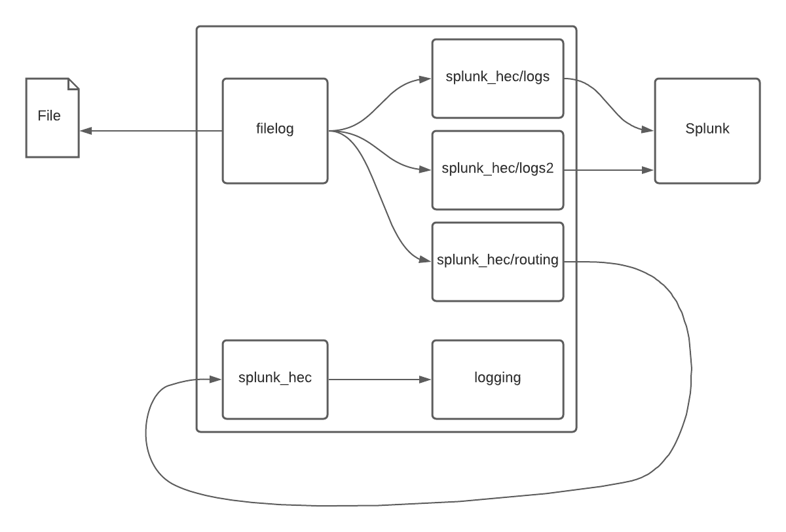

# OpenTelemetry complex routing example

This example showcases how the collector can collect data from files and route it to multiple destinations at once.

For the purpose of demonstration, we made the collector feed data back to itself to show that it is possible to sequence multiple collectors and have them send data to each other.



The example runs as a Docker Compose deployment. The collector is configured to send logs to Splunk Enterprise.

Splunk is configured to receive data from the OpenTelemetry Collector using the HTTP Event collector. To learn more about HEC, visit [our guide](https://dev.splunk.com/enterprise/docs/dataapps/httpeventcollector/).

To deploy the example, check out this git repository, open a terminal and in this directory type:
```bash
$> docker-compose up
```

Splunk will become available on port 18000. You can login on [http://localhost:18000](http://localhost:18000) with `admin` and `changeme`.

Once logged in, visit the [search application](http://localhost:18000/en-US/app/search) to see the logs collected by Splunk.
