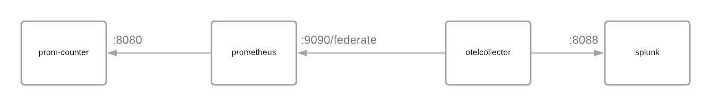

# Prometheus Federation Endpoint Example

This example showcases how the agent works with Splunk Enterprise and an existing Prometheus deployment.

The deployment creates a [golang program](./prom-counter) that exposes a metrics endpoint, with a specific metric named `counter`.

The [golang program](./prom-counter) is scraped by a Prometheus agent, [configured](./prometheus.yml) to collect data every 10 seconds.

The Prometheus instance exposes a [federation endpoint](https://prometheus.io/docs/prometheus/latest/federation/).

The OpenTelemetry Collector scrapes the Prometheus endpoint every 10 seconds as well, with the [following configuration](./otel-collector-config.yml):

```yaml
    prometheus_simple:
        collection_interval: 10s
        # the federation endpoint:
        # Read more about it here: https://prometheus.io/docs/prometheus/latest/federation/
        # You can query the federation with PromQL, encoded as part of the query string.
        endpoint: prometheus:9090
        metrics_path: /federate
        params:
            match[]: '{job="counter"}'
```

This configuration specifically scrapes metrics matching the query `{job="counter"}`.

The match expression is mandatory, and no metrics will be collected if it is omitted.

To pick up all metrics exposed by Prometheus, you can instead use the query `{job=~".+"}`.

## Run the example

The example runs as a Docker Compose deployment. The collector can be configured to send various metrics to Splunk Enterprise.

Splunk is configured to receive data from the OpenTelemetry Collector using the HTTP Event collector. To learn more about HEC, visit [our guide](https://dev.splunk.com/enterprise/docs/dataapps/httpeventcollector/).

To deploy the example, check out this git repository, open a terminal and in this directory type:
```bash
$> docker-compose up --build
```

Splunk will become available on port 18000. You can login on [http://localhost:18000](http://localhost:18000) with `admin` and `changeme`.

Once logged in, visit the [analytics workspace](http://localhost:18000/en-US/app/search/analytics_workspace) to see which metrics are sent by the OpenTelemetry Collector.

Additionally, you can consult the [Prometheus UI](http://localhost:9090) to see the metric data collected from the sample go program.

# Diagram of the deployment


