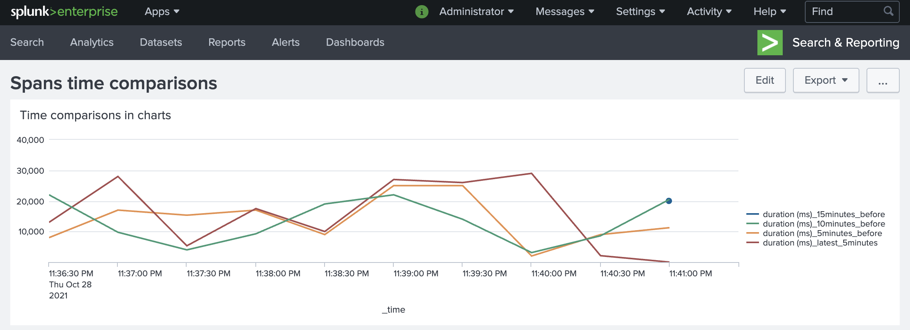

# HEC Traces Example

This example showcases how the agent works with Splunk Enterprise and traces.

The example runs as a Docker Compose deployment. The collector can be configured to send traces to Splunk Enterprise.

Splunk Enterprise is configured to receive data from the Splunk OpenTelemetry Connector using the HTTP Event Collector. To learn more about HEC, see [Configure the Splunk HTTP Event Collector](https://dev.splunk.com/enterprise/docs/dataapps/httpeventcollector/) for use with additional technologies.

To deploy the example:
1. Check out the [Splunk OpenTelemetry Connector repository](https://github.com/signalfx/splunk-otel-collector).
2. Open a terminal.
3. Type the following commands:
```bash
$> cd examples/splunk-hec-traces
$> docker-compose up --build
```
You can stop the example by pressing Ctrl + C.

Splunk Enterprise becomes available on port 18000. Log in to [http://localhost:18000](http://localhost:18000) with the user name `admin` and password `changeme`.

Once logged in, visit the [spans comparisons dashboard](http://localhost:18000/en-US/app/search/spans_time_comparisons) to see a comparison of traces over time sent by the Splunk OpenTelemetry Connector.

You can also search traces for information, such as querying by tag or any element of traces, by searching the traces index `index=traces`.

