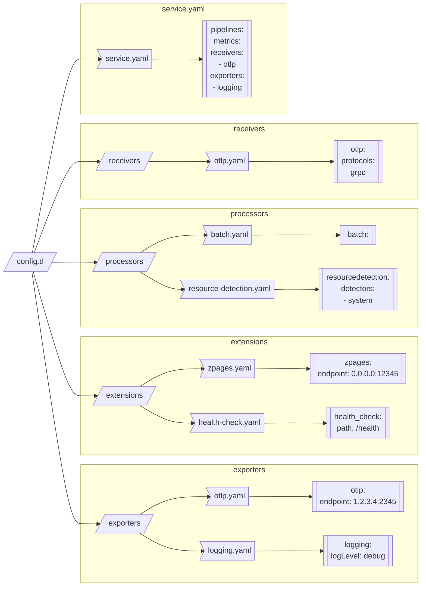

# Discovery confmap.Provider (Experimental)

**This component should not be considered stable. At this time its functionality is provided for testing and validation purposes only.**

The Discovery [confmap.Provider](https://pkg.go.dev/go.opentelemetry.io/collector/confmap#readme-provider) provides
the ability to define Collector service config through individual component yaml mappings in a `config.d` directory:

This component is currently exposed in the Collector via the `--configd` option with corresponding
`--config-dir <config.d path>` and `SPLUNK_CONFIG_DIR` option and environment variable to load
additional components and service configuration from the specified `config.d` directory (`/etc/otel/collector/config.d`
by default).
