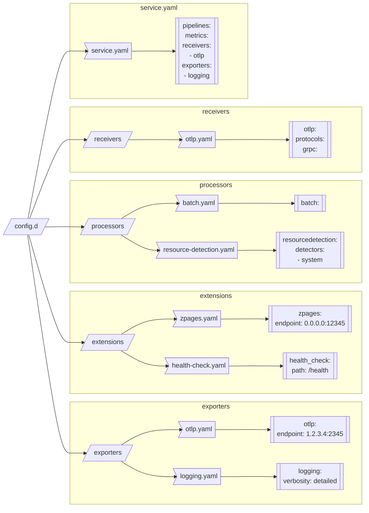

# Discovery confmap.Provider

**This feature currently has an [alpha](https://github.com/open-telemetry/opentelemetry-collector#alpha) stability level.<br>
Backwards incompatible changes to components and custom discovery configuration may occur.**

The Discovery [confmap.Provider](https://pkg.go.dev/go.opentelemetry.io/collector/confmap#readme-provider) provides
the ability to define Collector service config through individual component yaml mappings in a `config.d` directory:



This component is currently supported in the Collector settings via the following commandline options:

| option         | environment variable | default                        | description                                                                                                                             |
|----------------|----------------------|--------------------------------|-----------------------------------------------------------------------------------------------------------------------------------------|
| `--configd`    | none                 | disabled                       | Whether to enable `config.d` functionality for final Collector config content.                                                          |
| `--config-dir` | `SPLUNK_CONFIG_DIR`  | `/etc/otel/collector/config.d` | The root `config.d` directory to walk for component directories and yaml mapping files.                                                 |
| `--dry-run`    | none                 | disabled                       | Whether to report the final assembled config contents to stdout before immediately exiting. This can be used with or without `config.d` |

To source only `config.d` content and not an additional or default configuration file, the `--config` option or
`SPLUNK_CONFIG` environment variable must be set to `/dev/null` or an arbitrary empty file:

```bash
$ # run the Collector without a config file using components from a local ./config.d config directory,
$ # printing the config to stdout before exiting instead of starting the Collector service:
$ bin/otelcol --config /dev/null --configd --config-dir ./config.d --dry-run
2023/02/24 19:54:23 settings.go:331: Set config to [/dev/null]
2023/02/24 19:54:23 settings.go:384: Set ballast to 168 MiB
2023/02/24 19:54:23 settings.go:400: Set memory limit to 460 MiB
exporters:
  logging:
    verbosity: detailed
  otlp:
    endpoint: 1.2.3.4:2345
extensions:
  health_check:
    path: /health
  zpages:
    endpoint: 0.0.0.0:1234
processors:
  batch: {}
  resourcedetection:
    detectors:
    - system
receivers:
  otlp:
    protocols:
      grpc: null
service:
  pipelines:
    metrics:
      exporters:
      - logging
      receivers:
      - otlp
```

## Discovery Mode

This component also provides a `--discovery [--dry-run]` option compatible with `config.d` that attempts to instantiate
any `.discovery.yaml` receivers using corresponding `.discovery.yaml` observers in a "preflight" Collector service.
Discovery mode will:

1. Load and attempt to start any observers in `config.d/extensions/<name>.discovery.yaml`.
1. Load and attempt to start any receiver blocks in `config.d/receivers/<name>.discovery.yaml` in a
[Discovery Receiver](../../receiver/discoveryreceiver/README.md) instance to receive discovery events from all
successfully started observers.
1. Wait 10s or the configured `SPLUNK_DISCOVERY_DURATION` environment variable [`time.Duration`](https://pkg.go.dev/time#ParseDuration).
1. Embed any receiver instances' configs resulting in a `discovery.status` of `successful` inside a `receiver_creator/discovery` receiver's configuration to be passed to the final Collector service config in a new or existing `service::pipelines::metrics::receivers` sequence (or outputted w/ `--dry-run`). Any required observers will be added to `service::extensions`.
1. Log any receiver resulting in a `discovery.status` of `partial` with the configured guidance for setting any relevant discovery properties.
1. Stop all temporary components before continuing on to the actual Collector service (or exiting early with `--dry-run`).

Unlike `config.d` component files, which are direct configuration entries for the desired component, Discovery component
configs have an `enabled` boolean and `config` parent mapping field to determine use and configure the functionality of
the components:

```yaml
# <some-observer-type-with-optional-name.discovery.yaml>
<observer_type>(/<observer_name>):
  enabled: <true | false> # true by default
  config:
    <embedded observer config>
```

```yaml
# <some-receiver-type-with-optional-name.discovery.yaml>
<receiver_type>(/<receiver_name>):
  enabled: <true | false> # true by default
  rule:
    <observer_type>(/<observer_name>): <receiver creator rule for this observer>
  config:
    default:
      <default embedded receiver config>
    <observer_type>(/<observer_name>):
      <observer-specific config items, merged with `default`>
  status:
    metrics:
      <discovery receiver metric status entries>
    statements:
      <discovery receiver statement status entries>
```

By default, the discovery mode is provided with pre-made discovery config components in [`bundle.d`](./bundle/README.md).

The following components have bundled discovery configurations in the last Splunk OpenTelemetry Collector release:

I. Smart Agent receiver
* `collectd/mysql` monitor type ([Linux](./bundle/bundle.d/receivers/smartagent-collectd-mysql.discovery.yaml))
* `collectd/nginx` monitor type ([Linux](./bundle/bundle.d/receivers/smartagent-collectd-nginx.discovery.yaml))
* `postgresql` monitor type ([Linux and Windows](./bundle/bundle.d/receivers/smartagent-postgresql.discovery.yaml))

II. Extensions
* `docker_observer` ([Linux and Windows](./bundle/bundle.d/extensions/docker-observer.discovery.yaml))
* `host_observer` ([Linux and Windows](./bundle/bundle.d/extensions/host-observer.discovery.yaml))
* `k8s_observer` ([Linux and Windows](./bundle/bundle.d/extensions/k8s-observer.discovery.yaml))

### Discovery properties

Configuring discovery components is performed by merging discovery properties with the config.d receivers
and extensions `*.discovery.yaml` files. Discovery properties are of the form:

```yaml
splunk.discovery.receivers.<receiver-type(/name)>.config.<field>(<::subfield>)*: <value>
splunk.discovery.extensions.<observer-type(/name)>.config.<field>(<::subfield>)*: <value>
splunk.discovery.receivers.<receiver-type(/name)>.enabled: <true or false>
splunk.discovery.extensions.<observer-type(/name)>.enabled: <true or false>

# Examples
splunk.discovery.receivers.prometheus_simple.config.labels::my_label: my_label_value
splunk.discovery.receivers.prometheus_simple.enabled: true

splunk.discovery.extensions.docker_observer.config.endpoint: tcp://localhost:8080
splunk.discovery.extensions.k8s_observer.enabled: false
```

These properties can be in `config.d/properties.discovery.yaml` or specified at run time with `--set` command line options.

The `config.d/properties.discovery.yaml` file supports specifying the property values directly as well within a mapped form:

```yaml
# --set form will take priority to mapped values
splunk.discovery.receivers.prometheus_simple.config.labels::my_label: my_label_value
splunk.discovery.receivers.prometheus_simple.enabled: true

# mapped property form
splunk.discovery:
  extensions:
    docker_observer:
      enabled: false
      config:
        endpoint: tcp://localhost:54321
  receivers:
    prometheus_simple:
      enabled: false # will be overwritten by above --set form (discovery is attempted for the receiver)
```

Each discovery property also has an equivalent environment variable form using `_x<hex pair>_` encoded delimiters for
non-word characters `[^a-zA-Z0-9_]`:

```bash
SPLUNK_DISCOVERY_RECEIVERS_receiver_x2d_type_x2f_receiver_x2d_name_CONFIG_field_x3a__x3a_subfield=value
SPLUNK_DISCOVERY_EXTENSIONS_observer_x2d_type_x2f_observer_x2d_name_CONFIG_field_x3a__x3a_subfield=value
SPLUNK_DISCOVERY_RECEIVERS_receiver_x2d_type_x2f_receiver_x2d_name_ENABLED=<true or false>
SPLUNK_DISCOVERY_EXTENSIONS_observer_x2d_type_x2f_observer_x2d_name_ENABLED=<true or false>

# Examples
SPLUNK_DISCOVERY_RECEIVERS_prometheus_simple_CONFIG_labels_x3a__x3a_my_label="my_username"
SPLUNK_DISCOVERY_RECEIVERS_prometheus_simple_ENABLED=true

SPLUNK_DISCOVERY_EXTENSIONS_docker_observer_CONFIG_endpoint="tcp://localhost:8080"
SPLUNK_DISCOVERY_EXTENSIONS_k8s_observer_ENABLED=false
```

The priority order for discovery config values from lowest to highest is:

1. Pre-made `bundle.d` component config content (lowest).
2. `config.d/<receivers or extensions>/*.discovery.yaml` component config file content.
3. `config.d/properties.discovery.yaml` properties file mapped form content.
4. `config.d/properties.discovery.yaml` properties file --set form content.
5. `SPLUNK_DISCOVERY_<xyz>` property environment variables available to the collector process.
6. `--set splunk.discovery.<xyz>` property commandline options (highest).
