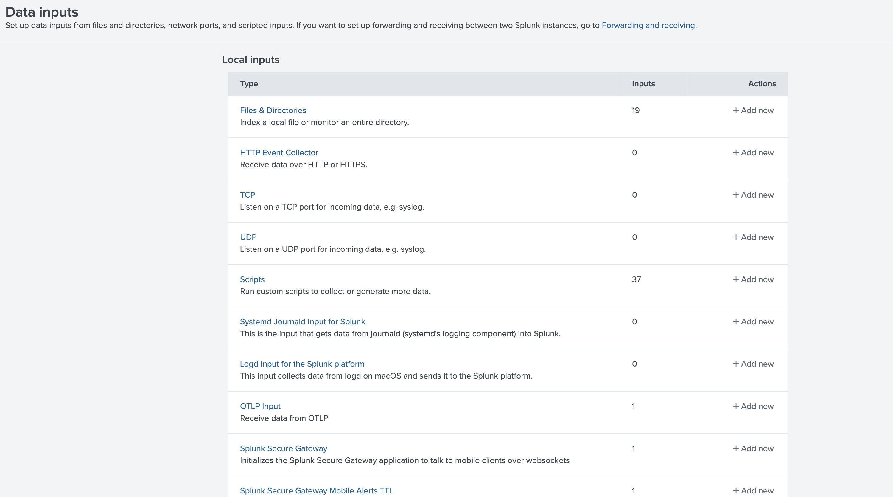
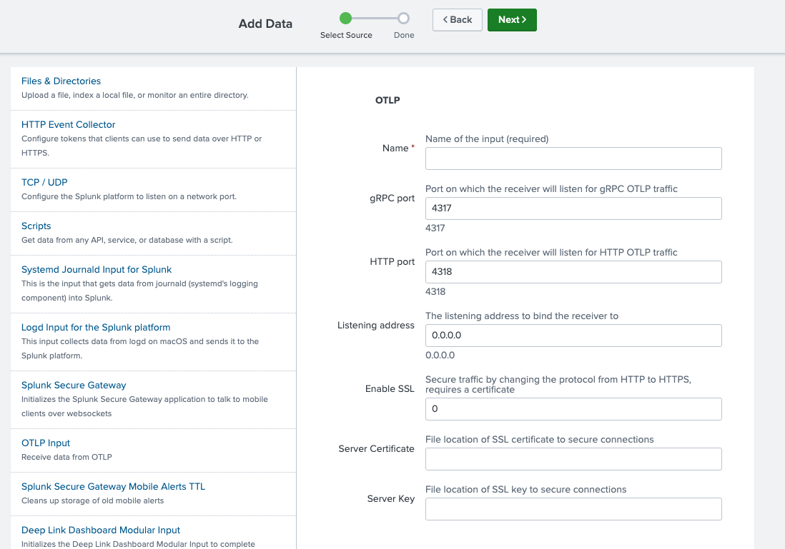

# Splunk Connect for OTLP

This directory contains a technical addon that exposes a OTLP endpoint for consumption of logs, traces and metrics.

# Usage

## Installation

Add the .tgz file to your Splunk apps by following these instructions: [Install an add-on in a single-instance Splunk Enterprise deployment
](https://docs.splunk.com/Documentation/AddOns/released/Overview/Singleserverinstall)

## Configuration

Create a new OTLP input in the data inputs.



Configure the OTLP input ports and network interface.



The input is configured as a data input in the Splunk Data Input settings.

You can set:
* The gRPC port and HTTP ports the OTLP receiver will listen on
* The network interface address on which the OTLP input will listen.

### TLS / SSL

SSL is **enabled by default** (`enableSSL = 1`). When enabled, both the gRPC and HTTP listeners require a server certificate and key. The input will fail to start if either is missing.

You must provide:

| Parameter    | Description                                |
|--------------|--------------------------------------------|
| `serverCert` | Path to the PEM-encoded server certificate |
| `serverKey`  | Path to the PEM-encoded server private key |

Example `local/inputs.conf` override:

```ini
[splunk-connect-for-otlp]
enableSSL = 1
serverCert = /path/to/server.crt
serverKey  = /path/to/server.key
```

To disable SSL (not recommended for production), set `enableSSL = 0`. See the [example folder](./example) for a full Docker Compose setup with TLS certificates generated automatically.

## HEC Token configuration

The OTLP addon inherits authentication and authorization associated with the HEC tokens defined on the Splunk instance.

Please define a HEC token as documented in [Splunk docs](https://help.splunk.com/en/splunk-enterprise/get-started/get-data-in/9.4/get-data-with-http-event-collector/set-up-and-use-http-event-collector-in-splunk-web).

Please make sure to allow indexes as needed ; any payload sending to indexes that are not allowed will be refused in its entirety.

## Sending OTLP

### Authentication

The OTLP endpoint is secured by a bearer token authentication, checking the Authorization header for a token authentication under the Splunk scheme.

Example of setup of the `otlp_http` exporter:

```yaml
exporters:
    otlp_http:
      endpoint: "http://splunk:4318"
      headers:
        authorization: "Splunk <TOKEN>"
```

### Attribute to event fields mapping

When sending OTLP data, this input interprets resource attributes to create HEC equivalents.

This table shows the resource attributes mapping:

| Resource attribute    | HEC event field |
|-----------------------|-----------------|
| com.splunk.index      | index           |
| com.splunk.sourcetype | sourcetype      |
| com.splunk.source     | source          |
| host.name             | host            |

OpenTelemetry protocol representation of a log record contains additional fields. The table below shows the mapping of those fields to HEC event indexed fields:

| Log record field | HEC event indexed field    |
|------------------|----------------------------|
| Severity text    | `otel.log.severity.text`   |
| Severity number  | `otel.log.severity.number` |
 
All other resource and individual log record attributes are mapped to indexed fields.

This mapping follows the OpenTelemetry specification.


### Example

Here is a collector configuration, reading logs from a file, sending OTLP data to a specific index `mylogs`:

```yaml
receivers:
    filelog/output:
      include: [ /output/file.log ]

exporters:
    otlphttp:
      endpoint: "http://splunk:4318"
      headers:
        authorization: "Splunk 00000000-0000-0000-0000-0000000000000"

processors:
    resource:
        attributes:
          - key: com.splunk.index
            value: "mylogs"
            action: insert

service:
    pipelines:
      logs:
        receivers: [filelog/output]
        processors: [resource]
        exporters: [otlphttp]
```

### Execution Logs

Use the Splunk query below to see the TA logs on your forwarder:

```splunk
index="_internal" "splunk-connect-for-otlp" source="/opt/splunk/var/log/splunk/splunkd.log" component="ExecProcessor" | fields event_message
```

## Build

Prerequisites:
* Go 1.24
* Make

Run:
```shell
$> make tgz
```

This will build the binaries, and assemble the TA tar.gz archive.

The archive is created as splunk-connect-for-otlp.tgz.

## Testing

### Run a Splunk instance locally

You can run a local Splunk instance with:
```shell
make splunk
```

Log in with `admin`/`changeme`.

Install the application by going to Apps > Manage Apps > Install application from file.

### Send via collector

See the [example folder](./example) for a collector configuration.

### Telemetrygen

You can generate a payload using [telemetrygen](https://github.com/open-telemetry/opentelemetry-collector-contrib/tree/main/cmd/telemetrygen).

Install telemetrygen with:
```shell
go install github.com/open-telemetry/opentelemetry-collector-contrib/cmd/telemetrygen@latest
```

Try running telemetrygen with:

```shell
$> telemetrygen metrics --otlp-insecure --otlp-endpoint 0.0.0.0:4317 --metrics 100 --workers 10
$> telemetrygen logs --otlp-insecure --otlp-endpoint 0.0.0.0:4317 --logs 100 --workers 10
$> telemetrygen traces --otlp-insecure --otlp-endpoint 0.0.0.0:4317 --traces 100 --workers 10
```

To try sending data to different indexes, add a resource attribute with the `--otlp-attributes` parameter.

Example to send to the `foo` metric index:
```shell
$> telemetrygen metrics --otlp-insecure --otlp-endpoint 0.0.0.0:4317 --metrics 100 --workers 10 --otlp-attributes com.splunk.index=\"foo\"
```

# Binary File Declaration
The following binaries are written in Go present in the source repository:
- linux_x86_64/bin/splunk-connect-for-otlp
- windows_x86_64/bin/splunk-connect-for-otlp
